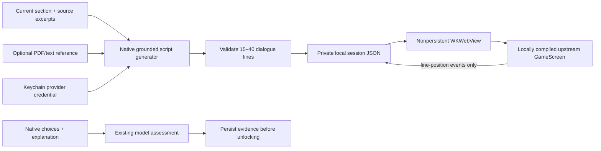

# Paper2Galgame local integration

Lumap runs the **actual React `GameScreen.tsx` from [Nova42x/paper2galgame](https://github.com/Nova42x/paper2galgame)** inside a native WKWebView. It is a locally installed upstream component, not a renamed native story card and not an iframe to the public demo site.

The adapter is intentionally narrow: the original upstream renderer owns typewriter dialogue, click-to-reveal/advance, Auto, six emotion states, technical notes, Log, Hide and Exit. Lumap owns document extraction, source-grounded model generation, private storage, custom character images, assessment and sequential learning progression. This retains Lumap's existing story questions, decisions, actual model evaluation and save-before-unlock rules.

## Install and build locally

From the standalone Lumap repository root:

```sh
python3 Paper2Galgame/Scripts/install_runtime.py
xcodegen generate
```

Then build the macOS `Lumap` or iOS `LumapiOS` scheme. Node.js/npm and Python 3 are required only for installation. The installed runtime is bundled with the **local build**, so playback needs no JavaScript CDN or Node server. Without installation, the story view shows an explicit setup message; it does not impersonate the upstream renderer.

The installer fetches exactly two files from pinned revision `da60826012493b16872add56d6c6d412197e6f1c`, verifies SHA-256, patches documented host hooks and compiles a local React/Tailwind/Vite bundle. The output is one classic IIFE script plus local CSS, avoiding `file://` ES-module CORS in WKWebView without relaxing web security. Dependency versions and transitive resolutions are pinned in `Web/package-lock.json`. npm uses a cache under `.local-build`, leaving the user's global cache alone.

Downloaded application code, compiled application resources and npm artifacts are excluded from Git. The public repository contains Lumap's native adapter, web host, installer, tests and provenance only. See [THIRD_PARTY_NOTICES.md](THIRD_PARTY_NOTICES.md) before distributing an app containing this optional runtime.

## What is connected

| Capability | Integration |
| --- | --- |
| Real upstream visual novel | Pinned GameScreen component, compiled locally; no remote demo iframe |
| Source-grounded teaching | Current course sources and optional learner-uploaded reference feed Lumap's configured model |
| Detail levels | Brief: 15–19 lines; detailed: 25–29; academic: 30–34; complete scripts validated, not a one-line fallback |
| Personality | Gentle, playful/tsundere or strict, bounded by age-appropriate teaching instructions |
| Actual provider | Existing custom Lumap endpoint, model and protocol; Chat, Responses and Anthropic-compatible support via the native client |
| API key | Keychain → native provider request only; never web payload, JavaScript storage, settings JSON or runtime files |
| PDF/text upload | Native PDFKit/UTF-8 extraction; empty/scanned and oversized files fail visibly; supplemental evidence stays on the current objective |
| Custom visuals | Import each of six emotion portraits and a background; image decode/thumbnail conversion, local settings storage |
| Default artwork | Original Lumap vector guide; no upstream third-party character artwork downloaded or redistributed |
| Playback | Original 30 ms typewriter, reveal/advance, Auto, technical notes, Log, Hide/restore and Exit/resume |
| Session persistence | Script, current line, activity ID and language saved atomically under the app's Application Support directory |
| Assessment | Existing story choices, written explanation, actual model feedback, saved evidence and completion; reading a chapter grants no progress |
| Failure and cancellation | 90-second total generation budget; one repair for invalid JSON; Stop waiting cancels the request; stale session results are discarded |
| Platforms | Shared SwiftUI + WKWebView adapter for macOS and iOS |

The inspected upstream does not itself supply custom API settings, custom portrait import, real learner grading or persistent saves. Those are Lumap additions. The original upstream Gemini PDF service is not included; Lumap extracts text locally and uses its own native provider client.

## Data and trust boundary



The web content receives only teaching text, safe data-image portraits, a local background, position and session identity. Its Content Security Policy prohibits network connections, forms, nested frames and plugins. Only main-frame file URLs under the installed runtime directory may navigate or send accepted bridge events. The bridge exposes `ready`, bounded current-session `progress`, and `exit`; it exposes no arbitrary file access, model credentials, grading or course-unlock operation.

## Validation

```sh
python3 -m unittest discover -s Paper2Galgame/Tests -v
```

`Paper2GalgameTests` covers dialogue validation, safe session filenames, bounded playback positions and credential-free settings. An opt-in real-model/WebKit test additionally generates a synthetic photosynthesis chapter, loads the actual local renderer, snapshots dialogue and history, and checks native progress events:

```sh
TEST_RUNNER_LUMAP_LIVE_PAPER2GALGAME_OUTPUT="$HOME/Library/Containers/com.local.lumap/Data/tmp/paper2galgame-live" \
  xcodebuild -project Lumap.xcodeproj -scheme Lumap -destination 'platform=macOS' \
  -only-testing:LumapTests/Paper2GalgameTests/testLivePaper2GalgameGenerationAndRuntimeSnapshot test
```

The opt-in test uses the user's already configured credential and spends model tokens. The default test suite skips that call. Screenshots and scripts are written only to the requested app-container directory and are not automatically published. Set `TEST_RUNNER_LUMAP_REUSE_PAPER2GALGAME_SCRIPT` to a previously generated script to repeat renderer checks without another model call.
