<div align="center">
  
  <h1>Lumap</h1>
  <p><strong>Follow your curiosity. Find your own way to understand.</strong></p>
  <p>A native, adaptive learning studio for Mac, iPhone and iPad.</p>
  <p>Built by <strong>Celestial Frontier</strong> for the University of Melbourne FEIT Hackathon.</p>
  <p>
    
    
    
    
  </p>
  <p><a href="#get-started">Get started</a> · <a href="#feature-highlights">Highlights</a> · <a href="#architecture">Architecture</a> · <a href="#lumapath-rl">LumaPath-RL</a> · <a href="#project-documentation">Documentation</a></p>
</div>

---

Lumap starts with a simple question: **What would you like to learn today?** You can name a topic, bring your own document, or explore an idea suggested from interests you have confirmed. The learning agent researches the subject, plans the necessary foundations, and turns the current section into activities that ask you to explain, predict, experiment and apply.

The aim is to help people discover what they want to understand—and make progress visible through evidence of understanding. The current product is a local-first MVP with real model calls, research, generated teaching materials, evaluation and persistence. The research architecture for a future trained reinforcement-learning policy is documented separately.

## Feature highlights

| Capability | What makes it useful |
| --- | --- |
| **An individual learning path** | The agent chooses the scope, foundations, examples and method sequence from the goal and learner context, then revises the next section using actual answers. |
| **One section at a time** | Future lessons stay hidden. A saved response and feedback drive the next activity; unfinished concepts receive another approach before progression. |
| **Mixed learning experiences** | Concept maps, worked examples, retrieval, dialogue, branching stories, simulations and transfer tasks make reasoning visible in different ways. |
| **Research before teaching** | Public-topic lessons start with retrieved sources. Document-based courses and multi-source Q&A use selected material and traceable citations. |
| **A lesson you can take away** | Generate a multi-slide lesson, complete natural narration and quizzes; export an editable PowerPoint, a narrated video or a full teaching script. |
| **Personal continuity** | Resume projects, inspect learning evidence and rewards, and move a course between Mac and iPhone using a portable Handoff file. |
| **Native Apple experience** | SwiftUI on macOS, iPhone and iPad; a Mac desktop companion; independent English/Chinese interface and teaching preferences. |
| **An explicit research direction** | LumaPath-RL specifies a custom constrained recommendation architecture for long-term learning, with state, action, reward, loss and evaluation designs. Training and deployment remain future work. |

### Navigate this repository

| Explore the product | Understand the technology | Build and extend |
| --- | --- | --- |
| [Learning loop](#how-learning-works) | [System architecture](#architecture) | [Quick start](#get-started) |
| [Screenshots and platforms](#native-on-mac-iphone-and-ipad) | [Runtime request sequence](#one-request-through-the-system) | [Tests and live evidence](#tests-and-a-reproducible-demo) |
| [Generated lesson and exports](#a-real-generated-lesson) | [LumaPath-RL design](#lumapath-rl) | [Troubleshooting](#troubleshooting) |
| [Learning method catalog](#a-repertoire-of-learning-methods) | [Data and privacy](#data-and-privacy-boundaries) | [Source map and documents](#project-map) |

## How learning works

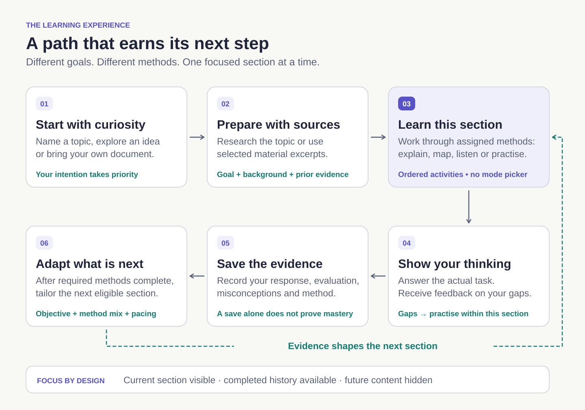

1. **Start with your intention.** A direct topic takes priority over recommendations. Upload a PDF or text file when the learning should be grounded in your own material.
2. **Let the agent prepare.** Public-topic research retrieves readable sources before course generation. The model receives the goal, available learning time, background, confirmed interests and relevant prior evidence.
3. **Focus on one section.** The agent assigns a small sequence of learning methods to the current section. Complete its activities before continuing; future section content stays out of the way. The number of sections depends on the subject and the learner.
4. **Make your thinking visible.** Explain a mechanism, choose a story branch, predict a counterfactual, solve a practice task or teach the idea back. The model evaluates the actual response and identifies specific gaps.
5. **Continue with a reason.** Results and misconceptions influence subsequent activities. Personal brings together saved projects, activity history, progress, feedback and rewards.

English is the default. Interface language and teaching language can be changed independently between English and Simplified Chinese. Both native targets currently use version **0.3.0 (build 3)**.

### Sequential by design

The initial planner requests **2–12 sections**, with **1–3 ordered methods per section** and at least one active exercise. These are personalized planning instructions, not a promise that everyone receives the same number of steps. The initial-plan validator accepts up to five methods for compatibility; next-section adaptation strictly validates one to three methods and an active exercise. Remediation can add another method to the current section.

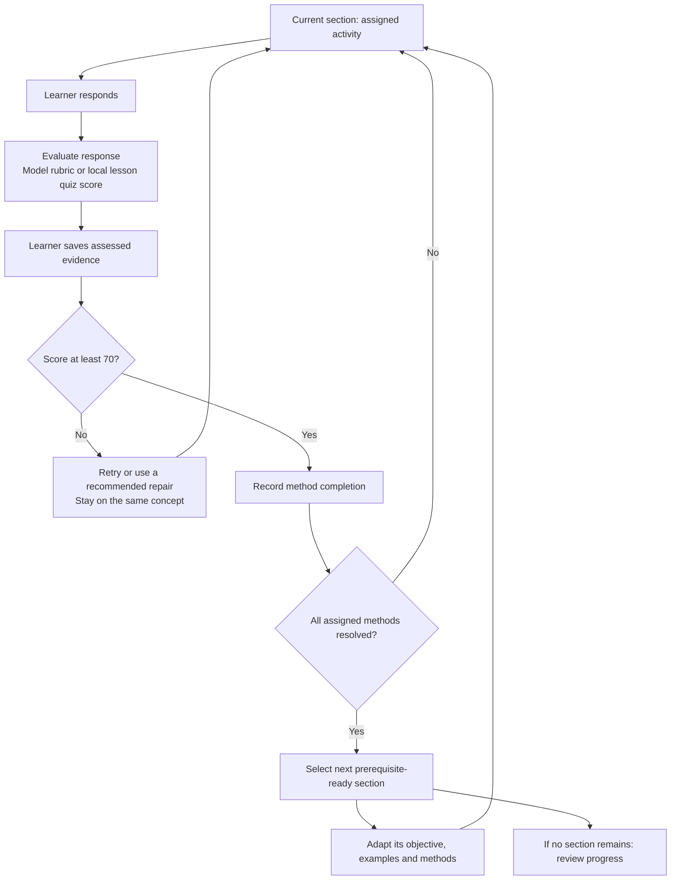

The **70/100** threshold is an application progression rule, not a certified measure of mastery. A successful alternative method can resolve earlier saved failures on the same concept. Model recommendations cannot bypass local prerequisite checks. Learners see the current section and completed history, without a menu exposing every future lesson or every possible method.

### What adaptation looks like

In a live development check, the same planned eigenvector section was adapted using two different **test contexts**:

| Input evidence supplied to the model | Adapted learning objective | Assigned methods |
| --- | --- | --- |
| Foundational difficulty; a mistaken assumption that matrix transforms always rotate by 90° | Compute matrix–vector products and identify vectors that stay on the same line. | Worked example → simulation → misconception diagnosis |
| Stronger prior understanding | Predict preserved or reversed directions and justify the scalar-multiple relationship. | Worked example → simulation → transfer challenge |

Both outputs preserved section `n2` and prerequisite `n1`, while changing its title, objective, duration and final activity. This demonstrates content adaptation in the running model integration; it is **not a study of learning effectiveness**. The model outputs from these synthetic test contexts are included as [repair example](docs/examples/eigenvectors-adaptation-repair.json) and [advance example](docs/examples/eigenvectors-adaptation-advance.json).

## Native on Mac, iPhone and iPad

<table>
  <tr>
    <td width="73%" align="center"><strong>macOS · a spacious starting point</strong><br /><br />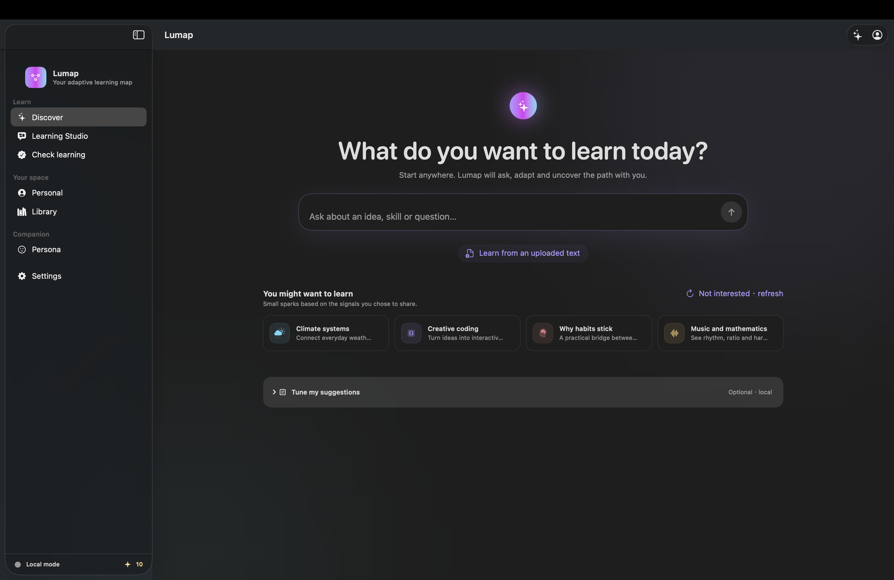</td>
    <td width="27%" align="center"><strong>iPhone · curiosity on the go</strong><br /><br />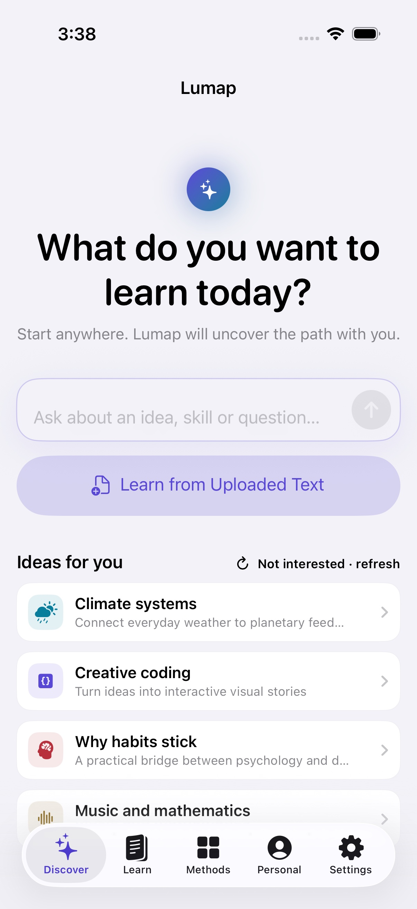</td>
  </tr>
</table>

*Actual app captures from 30 September 2026. These discovery examples show starter suggestions; teaching content and subsequent section activities are generated by the learning agent. Earlier captures can differ from the latest navigation.*

| Capability | macOS | iPhone / iPad |
| --- | --- | --- |
| Topic research, document learning and sequential activities | Native client | Native client |
| Source-grounded workspace, progress and local rewards | Available | Available |
| Provider configuration and credential storage | Settings + Keychain | Settings + Keychain |
| Kokoro narration | Local voice-pack installation | Import a voice-pack folder |
| Course Handoff | File export / import | Files / share workflow |
| Floating desktop Persona and menu bar | Available | Not a floating desktop feature |
| Spatial learning | Interactive concept preview | Interactive concept preview |
| Automatic cloud sync / production visionOS client | Planned | Planned |

## A real generated lesson

The image below comes from a six-slide photosynthesis lesson generated by the configured model from retrieved sources. It is an actual rendered lesson slide, not a product mockup.

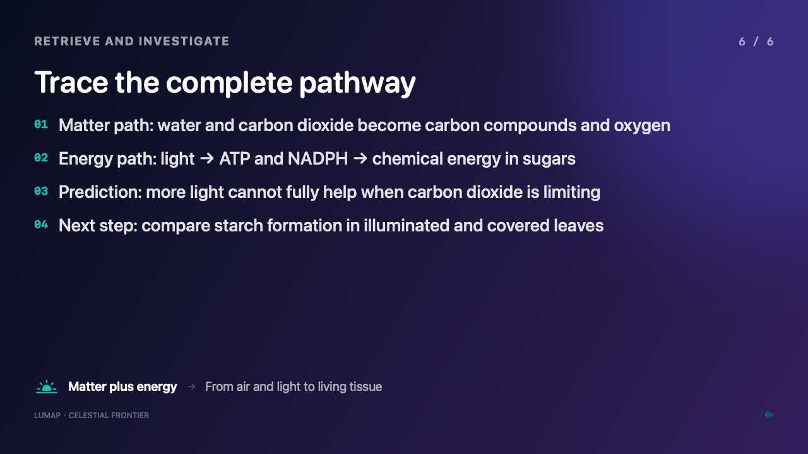

The verified example contains **6 slides, 622 words of narration and 2 retrieval quizzes**. Its exported **1280 × 720 MP4 runs for 4 minutes**, including complete local Kokoro narration and pauses for questions. Beginning and ending audio were decoded and checked, and the last chapter was inspected visually.

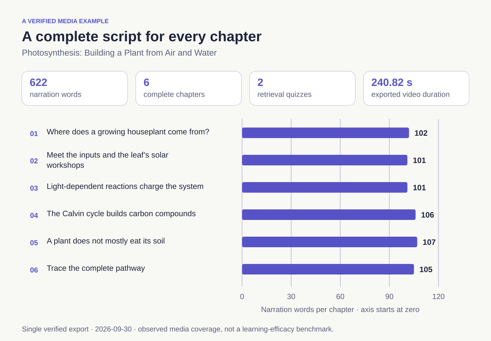

Download the real [editable sample deck](docs/examples/photosynthesis-lesson.pptx), read its [complete teaching script](docs/examples/photosynthesis-teaching-script.txt), or inspect the [export verification metadata](docs/examples/photosynthesis-verification.json). Large video files stay outside the source repository.

In the app, narration advances after audio completion. A quiz appears at the relevant chapter boundary, pauses progression, and gives feedback before continuing. Seeking and pause/resume are supported. Saving completed-lesson evidence requires listening to every chapter and answering all included quizzes.

Three portable exports are available:

| Export | What it contains |
| --- | --- |
| **Editable PowerPoint (`.pptx`)** | Native editable slide text and shapes; complete teaching scripts, source attribution and quiz answer keys in speaker notes. |
| **Narrated video (`.mp4`)** | H.264 video, a complete AAC audio track, and question/answer cards with thinking time. Quizzes in exported video are pause-and-think prompts; interactive answering happens in the app. |
| **Teaching script (`.txt`)** | Every slide, full narration, quiz options, answer explanations and source labels. |

Lesson generation is scoped to the **current section**, and cache identity includes the course and section. A different chapter cannot silently reuse another chapter's lesson. Incomplete model output is rejected; a missing provider or timeout displays a retryable error.

### From section to teaching media

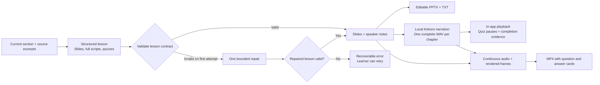

The local media pipeline uses **SwiftUI rendering, AVFoundation, sherpa-onnx and OpenXML**. Generation is performed by the configured model; speech synthesis and export run on the device. Generated lessons are teaching artifacts, not recordings of a person delivering a lecture.

## A repertoire of learning methods

The agent chooses methods for the section and the learner's observed needs. The catalog is a set of teaching tools, rather than a requirement for learners to select a pedagogical strategy themselves.

| Method | Interaction |
| --- | --- |
| Guided explanation | Build a concept in small, topic-specific steps. |
| Worked example | Inspect a concrete solution and explain the reasoning between steps. |
| Socratic dialogue | Work through questions with a model tutor grounded in the current lesson. |
| Analogy | Map a familiar situation to an unfamiliar concept and identify where the analogy breaks. |
| Visual concept map | Explore generated concepts and add relationships with your own explanation. |
| Branching story | Make choices in a topic-specific scenario; optionally use a local custom character portrait. |
| Flash recall | Attempt retrieval before revealing the answer. |
| Teach-back | Explain the concept in your own words and receive detailed feedback. |
| Simulation | Make predictions in a generated scenario and explain the effects of a change. |
| Deliberate practice | Work on a focused skill or misconception. |
| Reflection | Compare your initial understanding with your current explanation. |
| Misconception diagnosis | Challenge an incorrect claim and repair the underlying reasoning. |
| Curiosity branch | Choose a follow-up question, explain its connection to the current concept, and feed that evidence into the next section. |
| Counterfactual lab | Ask what would change if a condition or assumption were different. |
| Transfer challenge | Apply the idea to a new context. |
| Narrated lesson | Learn from a complete slide lesson with local narration and retrieval checks. |
| Spatial AR lab | Interact with a clearly labeled spatial concept preview. **Real camera-based supervision is not implemented.** |

Story mode is a native Lumap branching interaction inspired by the learning potential of visual novels. It is **not an embedded copy of the full upstream Paper2Galgame application**. Practical tasks and simulations currently use learner responses and model feedback; they do not independently verify a real-world experiment.

Different interactions produce different kinds of evidence:

| Learning purpose | Example methods | Evidence available to the app |
| --- | --- | --- |
| Build a mental model | Explanation, analogy, worked example, concept map | A learner's explanation, mapped relationship or reasoning about an example. |
| Retrieve and articulate | Flash recall, teach-back, Socratic dialogue | Pre-reveal recall answers, the learner's own explanation or their dialogue turns. |
| Explore consequences | Story, simulation, counterfactual lab | A choice or prediction plus the reasoning behind it. |
| Repair and generalize | Diagnosis, deliberate practice, transfer | A corrected misconception or a solution in a new context. |
| Reflect and choose a direction | Reflection, curiosity branch | A changed explanation or a learner-selected question and its connection to the current concept. |
| Learn through narrated media | Narrated lesson | Chapter-listening completion and first-answer quiz correctness, scored locally. |

The model grades ordinary activity responses against the displayed task. Listening time, tutor-generated text and a completed button press are not treated as proof of understanding. Narrated-lesson quizzes use a local answer-key calculation after all chapters and quizzes are complete.

## Beyond the lesson

| Area | Working capability |
| --- | --- |
| **Discover** | Direct topic input, document learning, personalized topic suggestions and “not interested” refresh. |
| **Guided Study** | A staged, source-grounded learning workflow with questions, evidence and feedback. |
| **Knowledge Studio** | Select multiple imported materials or current course sources, ask questions with citations, and turn selected material into a course. |
| **Adaptive Path** | Inspect the current learning evidence, method observations, misconceptions and the reason for a next step. |
| **Interest profile** | Submit a public profile URL for readable-page analysis; confirm or remove the model's suggested interests. Import history for local aggregate suggestions. |
| **Handoff** | Export a validated course-and-evidence JSON package and import it on another device via Files or AirDrop. |
| **Personal** | Resume learning projects on Mac and iPhone, start optional theory/practice checks, review activity history and assessment results, and manage appearance and the reward wallet. |
| **Persona** | A macOS floating companion with current-course summaries, questions, another explanation and a learning timer. It appears when the main window is minimized. |
| **Rewards** | A persistent local ledger, duplicate-award protection and an unlimited demo learning allowance. Themes are unlocked. |

Handoff is an explicit file transfer, not automatic cloud synchronization. Persona responds to learning context inside Lumap; it does not watch the screen, browser or other apps. Provider billing and physical reward fulfillment are not connected to the local reward ledger.

## Architecture

Lumap has a **native client architecture with a shared Swift domain layer**. Its current deployment requires no Lumap-hosted application server: the app manages learning state, retrieval, validation, storage, narration and exports, and calls a configured model endpoint for generation and evaluation.

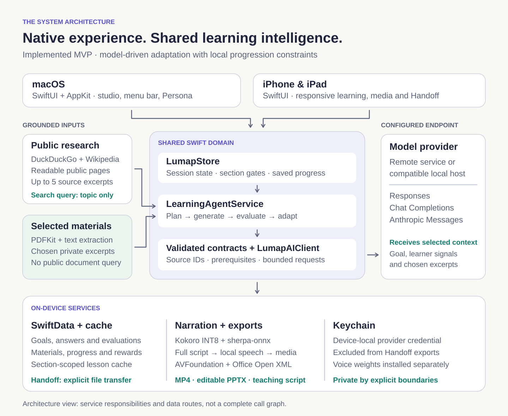

### Technology stack

| Layer | Technology | Responsibility |
| --- | --- | --- |
| Native experience | Swift 6, SwiftUI; AppKit on Mac | Responsive screens, section activities, desktop Persona and platform integration. |
| Application state | `LumapStore`, Swift concurrency | Active course, ordered methods, request cancellation, evidence and progress. |
| Persistence | SwiftData, Codable JSON, Keychain | Local entities, structured plan/session snapshots and separately stored credentials. |
| Agent orchestration | `LearningAgentService`, validated contracts | Plan, generate, tutor, assess, recommend and adapt a section. |
| Research | URLSession, DuckDuckGo HTML, Wikipedia, public-page extraction | Retrieve readable excerpts and retain source provenance. |
| Private materials | PDFKit and text extraction | Bounded local extraction; selected excerpts for document-based learning. |
| Model transport | Responses, Chat Completions, Anthropic Messages | Configurable providers, response parsing, wall-clock deadlines and error handling. |
| Local natural speech | Kokoro INT8, sherpa-onnx, ONNX Runtime | On-device narration using separately installed model assets. |
| Portable teaching media | SwiftUI rendering, AVFoundation, Office Open XML | Slide images, complete audio, MP4, editable PPTX and teaching scripts. |
| Device continuity | Versioned Codable Handoff package | Validated course/evidence transfer through Files or AirDrop. |
| Spatial exploration | SwiftUI preview; iOS capability detection | Interactive concept visualization; real AR supervision is a future extension. |
| Recommendation research | Designed POMDP/SMDP, constrained offline RL and OPE | Future custom policy training and evaluation; not a runtime dependency today. |
| Build and verification | Xcode, XcodeGen, XCTest | Shared targets, reproducible project configuration and state/contract checks. |

<details>
<summary><strong>Expand the current component dependency map</strong></summary>

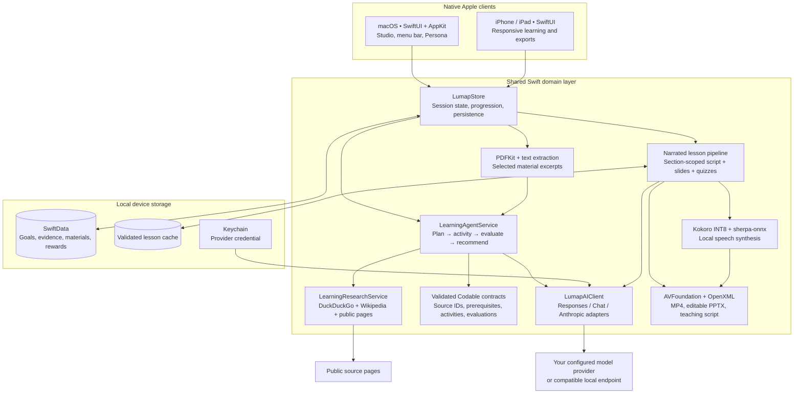

</details>

### One request through the system

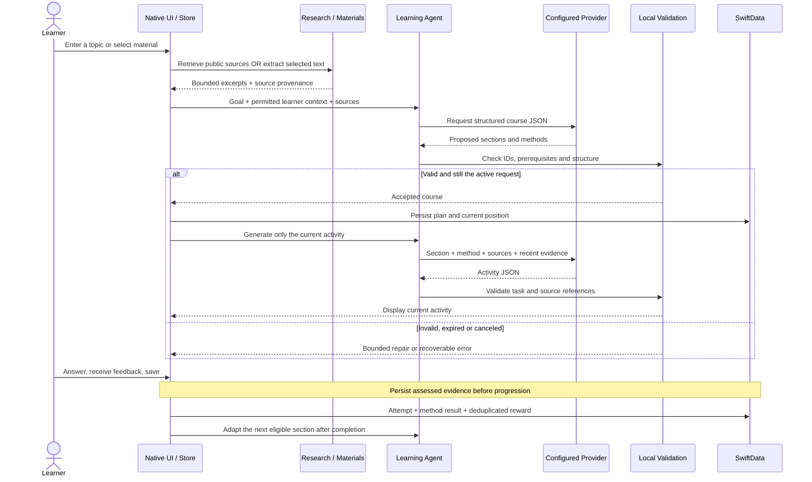

The diagram abbreviates the assessment call: ordinary responses go back through the agent and provider for a rubric evaluation, whereas narrated quizzes are checked locally. Every later asynchronous result must still belong to the active goal, section and request before it changes the UI.

### Research, planning and grounded generation

`LearningResearchService` normalizes a stated learning intention into a search query, queries independent public sources, fetches readable text and retains up to five deduplicated sources. Each excerpt carries a title, URL, retrieval time and app-assigned source ID. The model can cite these IDs; validation rejects references outside the retrieved set.

`LearningAgentService` produces structured course nodes with learning objectives and prerequisite relationships, then generates an activity for the active node. The app validates the returned structure before showing or saving it. Source text is treated as evidence rather than instructions. URL validation, redirect checks, time limits and bounded response sizes apply to research requests. A valid citation ID confirms which source was referenced; it does not independently establish that every generated claim is correct.

Uploaded-material courses use the selected excerpts directly. Private document text is not submitted as a public search query. The MVP uses explicit excerpts, not a vector database or full-document semantic index.

### Personalization and learning evidence

The runtime uses confirmed interests, background, available time, previous answers, rubric scores, misconceptions and method observations to condition the model. Local progression rules constrain the model's decisions and protect section ordering, prerequisite readiness and saved progress.

Activity evidence records the node and method, the learner's actual response, evaluation, timing and provenance. Saving an activity does not automatically mean mastery. Missing assessment evidence remains missing; repeated saves do not repeatedly grant rewards. Historical method scores are **observational signals**, not a demonstrated causal estimate of which method is best for a person.

**LumaPath-RL is a research design, not a trained model shipped in this MVP.** The LaTeX specification describes the intended state/action formulation, objectives and constrained recommendation architecture. Current adaptation is performed by model decisions plus local validation and evidence-based rules. The repository does not claim a completed offline training run or measured learning gains.

### Reliable generation and media

All model features share `LumapAIClient`: provider connection tests, planning, activities, tutor dialogue, evaluation, recommendations and material Q&A. It supports configurable endpoints and model IDs, rejects incomplete responses, and applies wall-clock deadlines with cancellation.

Narrated lessons require at least five slides and two valid quizzes. The generator requests a full spoken script per slide and makes one bounded repair attempt if the response fails its contract. Production generation never silently falls back to a fixed demo lesson. The overall narrated-generation deadline is 210 seconds, after which the learner can retry.

Kokoro runs locally through sherpa-onnx and ONNX Runtime. MP4 export renders constant-rate video frames and builds one continuous PCM master, including quiz thinking intervals, before encoding the final movie. Source media assets are retained for the whole export. PPTX export writes editable Office Open XML in a ZIP archive without a server dependency.

| Failure mode | Implemented response |
| --- | --- |
| Malformed or incomplete agent contract | Plan/activity/evaluation requests allow one repair attempt within a shared 90-second generation budget, then an explicit error. |
| Incomplete narrated lesson | A separate lesson contract and bounded repair operate within the overall 210-second narrated-generation deadline. |
| An activity remains pending | A 120-second UI watchdog cancels it and exposes recovery; the learner can also stop generation. |
| A response arrives after the learner changes course | Request identity and goal/node checks reject stale results. |
| A proposed transition skips prerequisites | The local store rejects it; the model does not directly mutate progression. |
| A lesson is cached for a different section | Course/section/context identity prevents unrelated cache reuse. |
| Voice assets or a provider route are unavailable | Show the missing dependency or provider error; do not substitute a fixed lesson or system voice. |

## LumaPath-RL

**LumaPath-RL is our custom recommendation-system design for choosing what, how and how much to learn next.** Its target is durable understanding, transfer and learner agency. The current app implements the surrounding learning loop with an evidence-conditioned language-model planner and local constraints. It does **not** ship trained RL weights, a policy-serving backend or an offline RL dataset.

### Today and the target architecture

| Dimension | Implemented in the app | Designed RL extension |
| --- | --- | --- |
| Learner representation | Volunteered background, age band, language, time budget, confirmed interests and recent answer/method evidence. | A belief state with uncertainty about mastery, retention, load and evidence quality. |
| Discovery | Model-generated suggestions conditioned on context and rejected topics. | A constrained contextual **slate bandit** for a diverse set of learning directions. |
| In-session decisions | Model-assigned sections/methods, rubric feedback and next-section regeneration. | A hierarchical **POMDP** with **SMDP** duration-aware decisions. |
| Progression authority | Client-side saved-evidence, completion and prerequisite rules. | Keep client validation; add policy masks, versioned decisions and cumulative cost constraints. |
| Learning signals | Actual answers, model rubric scores, local quiz results and observed method outcomes. | Calibrated mastery change, delayed retention, transfer and explicit autonomy feedback. |
| Training and evaluation | Unit/integration checks and live functional examples. | Supervised state training, conservative offline RL, off-policy evaluation and guarded deployment. |
| Rewards | A separate local Lumens ledger for product incentives. | A mathematical learning reward; credits and demo allowance do not become reward terms. |

### State, actions and constraints

The target treats knowledge as partially observed. A correct answer is evidence about understanding, not a complete view of it. The belief encoder combines the prior belief, previous activity, new observation, elapsed time and allowlisted context:

$$
b_t=f_\phi(b_{t-1},a_{t-1},o_t,\Delta t_t,z_t).
$$

| Symbol / component | Meaning in the proposed model |
| --- | --- |
| $b_t$ | Belief about concept mastery and uncertainty, retention, cognitive load, method outcomes and evidence quality. |
| $o_t$ | Observed answers, assessments, hints, timing and explicit learner feedback. Missing evidence remains missing. |
| $z_t$ | Current goal, volunteered context, time budget, device/accessibility capabilities and valid permissions. |
| $a_t=(g_t,c_t,m_t,d_t,x_t)$ | Learning intent, concept, method, dose/duration and concrete content instance. |
| $\mathcal A_{\mathrm{legal}}(b_t)$ | Candidates that satisfy prerequisites, explicit intent, permissions and device/content restrictions. |

The hierarchical policy separates the learning direction from presentation and content selection:

$$
\pi(a_t\mid b_t)=
\pi_G(g_t,c_t\mid b_t)\,
\pi_M(m_t,d_t\mid b_t,g_t,c_t)\,
\pi_X(x_t\mid b_t,g_t,c_t,m_t,d_t).
$$

In the optimization equations below, $\pi$ denotes this policy after masking and renormalizing over legal actions.

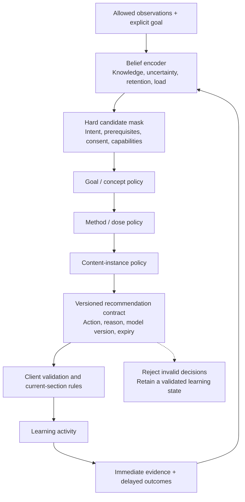

*Target RL serving architecture. The current app's model planner occupies the decision-making role; the belief encoder and learned policy heads shown here are proposed components.*

### Reward and optimization objective

The proposed reward combines mastery gain $\Delta M_t$, delayed retention $R_{24h},R_{7d}$, transfer $T_t$, autonomy $A_t$ and goal progress $\Delta G_t$, with penalties for frustration $F_t$, overload $O_t$, unproductive repetition $P_t$ and excessive hint dependence $H_t$:

$$
\begin{aligned}
r_t={}&w_M\Delta M_t+w_{24}R_{24h}+w_7R_{7d}
       +w_TT_t+w_AA_t+w_G\Delta G_t\\
     &-w_FF_t-w_OO_t-w_PP_t-w_HH_t.
\end{aligned}
$$

Weights are design parameters that still require calibration. Delayed outcomes stay pending until measured; absence is not scored as failure. Clicks, streaks, time spent and token consumption are not standalone positive learning rewards. **The app's Lumens wallet is separate from this RL reward.**

Duration-aware discounting accounts for activities of different lengths. For elapsed duration $D_t=\sum_{u<t}\Delta_u$ and cumulative cost budgets $d_j$, the proposed constrained objective is:

$$
\max_\pi\;\mathbb E_\pi\!\left[\sum_t\gamma^{D_t}r_t\right]
\quad\text{subject to}\quad
\mathbb E_\pi\!\left[\sum_t\gamma^{D_t}c_t^{(j)}\right]\le d_j.
$$

Hard restrictions remove illegal actions before ranking. Cost budgets address cumulative effects, such as excessive load or interruption, among otherwise legal actions; a high predicted reward never authorizes a forbidden action.

### Training losses

The design uses separate state, behavior, reward-critic, cost-critic and actor models. The summary below follows the [LaTeX RL specification](docs/latex/Lumap_RL_Recommendation_Architecture.tex); symbols are simplified for readability.

| Training component | Loss / purpose |
| --- | --- |
| Belief-state supervision | BCE for mastery/retention/hint outcomes; Huber losses for time/load; Brier calibration for confidence. |
| Behavior model $\hat\mu$ | Estimate supported behavior from logged legal candidate sets and decisions. |
| Twin reward critics $Q_1,Q_2$ | Bellman error plus a conservative value penalty; use the smaller target value. |
| Twin cost critics per constraint | Predict accumulated costs; use the larger estimate in the policy constraint. |
| Hierarchical actor $\pi$ | Improve conservative value while limiting drift from observed behavior and controlling costs. |
| Nonnegative multipliers $\lambda_j$ | Dual ascent increases pressure when a cost estimate exceeds its budget. |

For a logged transition $(b,a,r,b',\Delta)$, terminal indicator $\delta$ and target critics $\bar Q_i$:

$$
y=r+(1-\delta)\gamma^{\Delta}
\mathbb E_{a'\sim\pi(\cdot\mid b')}
\!\left[\min_{i\in\{1,2\}}\bar Q_i(b',a')-\tau\log\pi(a'\mid b')\right].
$$

The conservative critic loss is:

$$
\begin{aligned}
\mathcal L_{\mathrm{critic}}^{(i)}={}&
\tfrac12\mathbb E_{\mathcal D}\!\left[(Q_i(b,a)-y)^2\right]\\
&+\alpha\mathbb E_b\!\left[
\log\sum_{a\in\mathcal A_{\mathrm{legal}}(b)}e^{Q_i(b,a)}
-\mathbb E_{a\sim\mu(\cdot\mid b)}Q_i(b,a)
\right].
\end{aligned}
$$

This adapts the conservative value-regularization idea from [Conservative Q-Learning](https://arxiv.org/abs/2006.04779) to a finite, legal recommendation candidate set. Its purpose is to reduce unsupported value optimism during offline training; it is not a guarantee that generated educational content is correct.

<details>
<summary><strong>Actor objective and constraint update</strong></summary>

$$
\begin{aligned}
\mathcal L_{\mathrm{actor}}={}&
-\mathbb E_{b\sim\mathcal D,a\sim\pi}\min_i Q_i(b,a)
+\beta\mathbb E_b D_{\mathrm{KL}}(\pi\Vert\hat\mu)
-\tau\mathbb E_b\mathcal H(\pi)\\
&+\sum_j\lambda_j
\left(\mathbb E_{b_0\sim\rho_0,a_0\sim\pi}\max_k Q_k^{C_j}(b_0,a_0)-d_j\right),\\
\lambda_j\leftarrow{}&
\left[\lambda_j+\eta_\lambda(\widehat J_{C_j}-d_j)\right]_+.
\end{aligned}
$$

The actor balances conservative reward, a KL penalty against the estimated behavior policy, entropy and predicted constraint costs. Each $Q_k^{C_j}$ estimates cost $j$; the maximum of the twin estimates is used conservatively. Here $\rho_0$ is the defined episode initial-state distribution, so the cost comparison matches the episodic budget rather than an arbitrary average over replay states. Dual updates and release gates would estimate $\widehat J_{C_j}$ for that same distribution using duration-aware evaluation. Multipliers use **dual ascent**, not ordinary minimization of the actor loss. These equations describe the research design; no optimized weights or tuned hyperparameters are distributed.

</details>

### From evidence to a deployable policy

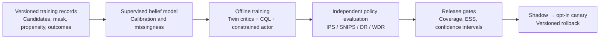

*Proposed training and release pipeline; none of these boxes imply a completed training run.*

Off-policy evaluation requires recorded candidate sets, legal-action masks and actual behavior propensities, with sufficient overlap between logged and proposed actions. The current saved attempt history does **not** contain that complete contract and is not an OPE-ready dataset. Proposed checks include effective sample size (ESS), action coverage and learner-cluster bootstrap intervals, followed by retention, transfer, calibration and cohort-level degradation checks. Sequential evaluation draws on [doubly robust off-policy evaluation](https://arxiv.org/abs/1511.03722) and [data-efficient off-policy evaluation](https://arxiv.org/abs/1604.00923).

There are no claimed learning-gain percentages, benchmark wins or production RL results in this repository. The [RL architecture PDF](docs/pdf/Lumap_RL_Recommendation_Architecture.pdf) provides the longer mathematical design. Its older “current MVP” passages are historical; the implementation status in this README and the Swift sources takes precedence.

## Get started

### Requirements

- A Mac with **Xcode 26 or newer** and Command Line Tools for building the Swift 6 project.
- **macOS 14+** to run the Mac app; **iOS/iPadOS 18+** for the mobile app.
- Internet access for the initial pinned Swift Package resolution, public research and remote model generation.
- Your own model-provider account, or a compatible local endpoint.
- The optional local Kokoro voice pack for narration and narrated-video export.

```bash
git clone https://github.com/Ar1haraNaN7mI/LuMap---Celestial-Frontier.git
cd LuMap---Celestial-Frontier
open Lumap.xcodeproj
```

Choose the **Lumap** scheme and **My Mac**, then run. For mobile development, choose **LumapiOS** and an iPhone/iPad simulator or a configured physical device. Device deployment requires your own Apple signing setup. The iOS client has its own local data store; use Handoff when you want to transfer a course.

The generated Xcode project is committed. XcodeGen is only needed when changing `project.yml`:

```bash
xcodegen generate
```

### Configure a model

Open **Settings → AI provider**, choose a protocol, enter the endpoint and model ID, save your credential, and run the connection test.

| Setting | Supported behavior |
| --- | --- |
| Protocol | OpenAI-compatible Responses, Chat Completions or Anthropic Messages. |
| Endpoint | A provider base URL or the full protocol route. A `/v1` base is resolved to `/v1/responses` when Responses is selected. |
| Model | A model ID your provider actually serves. The current demonstration was verified with `gpt-5.6-sol` through the configured third-party gateway. |
| Credential | Stored in the device Keychain; never in the repository or course export. |
| Local service | A compatible loopback endpoint can be used without a key when the service permits it. |

The built-in demonstration defaults are `https://api.ikuncode.cc/v1`, Responses, and `gpt-5.6-sol`. These are configurable provider settings; a working account and available model route are required. Lumap does not include a shared API key or a free hosted model service. Provider-side quota and routing errors are surfaced in the app. See the [provider runbook](docs/Custom_Model_Provider_Runbook.md) for operational details.

### Install natural local narration

Lumap uses **Kokoro**, not the system speech voice. The large model assets stay outside Git and the app bundle.

On macOS:

```bash
./Scripts/install-kokoro-voice-pack.sh
```

The installer downloads a pinned official model archive, validates its size and SHA-256, and installs it into Lumap's sandbox Application Support directory. On iOS, import an already downloaded and extracted model folder in Settings. The app validates its required files before copying it into local storage. Return to the narrated lesson after installation; voice availability refreshes on activation, and the player also offers a manual pack check.

Without the voice pack, slides and the full script—including quiz prompts and answers—remain available; playback and narrated-video export clearly report that narration is unavailable. There is no hidden system-TTS fallback. The [voice integration document](docs/Open_Source_Voice_Integration.md) describes the model manifest, installation and platform details.

### Build from the terminal

```bash
# macOS
xcodebuild -project Lumap.xcodeproj -scheme Lumap \
  -configuration Debug -destination 'platform=macOS' \
  -derivedDataPath .build/DerivedData build

# iPhone / iPad simulator
xcodebuild -project Lumap.xcodeproj -scheme LumapiOS \
  -configuration Debug -destination 'generic/platform=iOS Simulator' \
  -derivedDataPath .build/iOSDerivedData build
```

The Mac build is written to `.build/DerivedData/Build/Products/Debug/Lumap.app`.

## Tests and a reproducible demo

The [30 September learning-flow update](docs/updates/2026-09-30-learning-polish.md) adds iPhone optional assessments and project resume, reliable terminal course status, cancellable section adaptation, quiz-safe narration, and recommendation invalidation after profile changes. Its verification run passed **81 default tests** (3 explicit opt-ins skipped), both platform builds, and a separate real-provider assessment test. The update includes actual synthetic-input model output and a manual walkthrough.

```bash
xcodebuild -project Lumap.xcodeproj -scheme Lumap \
  -configuration Debug -destination 'platform=macOS' \
  -derivedDataPath .build/DerivedData test
```

Tests cover contracts and citations, course isolation, persistence, progression, evaluation evidence, duplicate rewards, provider routing, incomplete lesson rejection, presentation export and narration. Regular tests do not request paid model generations. A voice-rendering test runs only when the optional pack is installed; the full research/lesson/video test is explicitly opt-in.

### Recorded validation

The earlier baseline validation recorded for **0.3.0, source revision `2e55dd7`**, was performed on **30 September 2026**. These are development checks, not a hosted CI badge or a learning-outcome evaluation.

| Check | Observed result | What it establishes |
| --- | --- | --- |
| macOS XCTest suite | **58 passed, 2 opt-in tests skipped, 0 failures** | Tested state transitions, contracts, isolation, persistence and export behavior. |
| iOS Simulator target | **Build succeeded** | The shared code and mobile target compile for the simulator; this is not certification on every physical device. |
| macOS Release target | **Build succeeded** | Release configuration builds. |
| Live topic generation | Distinct photosynthesis and eigenvector content; different adapted objectives and methods | The configured model influences real teaching content and progression. |
| Live grounded workspace | Source-based Q&A and a course generated from selected excerpts | Material processing and provider integration operate together. |
| Complete narrated export | 6 slides, 622 words, 2 quizzes, 240.82 seconds, one audio and one video track | The inspected sample contains complete teaching media across chapters. |

The two skipped tests require explicit opt-in for live workspace and narrated-model requests; they were also exercised separately during live validation. The [sample metadata](docs/examples/photosynthesis-verification.json), [editable deck](docs/examples/photosynthesis-lesson.pptx), [script](docs/examples/photosynthesis-teaching-script.txt) and [adaptation outputs](docs/examples/eigenvectors-adaptation-repair.json) make the relevant examples inspectable. Results from one provider configuration do not imply universal model compatibility.

<details>
<summary><strong>Run the opt-in integration checks</strong></summary>

These two development tests currently pin `https://api.ikuncode.cc/v1`, Responses and `gpt-5.6-sol`, and read the `active-provider` credential from the test host's Keychain. Use a credential valid for that gateway; to test a different provider, update the test configuration first. Install the local voice pack for the narrated test. The checks send model requests and can consume provider quota. Their output directories should remain local and untracked.

```bash
# Grounded material Q&A and source-only course generation
TEST_RUNNER_LUMAP_LIVE_WORKSPACE_OUTPUT="$PWD/tmp/live-workspace" \
xcodebuild -project Lumap.xcodeproj -scheme Lumap \
  -configuration Debug -destination 'platform=macOS' \
  -derivedDataPath .build/DerivedData \
  -only-testing:LumapTests/LearningWorkspaceTests/testLiveGroundedQuestionAndSourceOnlyCourse test

# Real research, a complete lesson and narrated video export
TEST_RUNNER_LUMAP_LIVE_NARRATED_OUTPUT="$PWD/tmp/live-narrated" \
xcodebuild -project Lumap.xcodeproj -scheme Lumap \
  -configuration Debug -destination 'platform=macOS' \
  -derivedDataPath .build/DerivedData \
  -only-testing:LumapTests/NarratedLessonMVPTests/testLiveResearchedLessonAndCompleteVideo test
```

</details>

### Live walkthrough

A useful live walkthrough:

1. Configure a working provider and enter **“I want to understand photosynthesis.”** Allow research and planning to finish.
2. Complete the assigned activities in the current section. Include a misconception such as “most plant mass comes from soil,” then inspect the feedback and try a corrected explanation.
3. Continue only when the section is ready. Review the assigned method and the current learning evidence.
4. In a narrated section, play all chapters, answer the quizzes and export the lesson as PPTX, script or video.
5. Try a substantially different topic, such as **eigenvectors**, and compare its explanations, examples and sources.
6. In Knowledge Studio, select an imported document, ask a grounded question, inspect its citations and start a course from the selected material.
7. Review Personal, transfer a course through Handoff, then show the separately labeled AR concept preview.

The [video recording script](docs/Lumap_Video_Demo_Script.md) gives additional recording guidance. Older screenshots and design documents may depict earlier navigation; this README's behavior description follows the current implementation.

## Troubleshooting

| Symptom | What to check or do |
| --- | --- |
| Provider connection or generation fails | Check the selected protocol, endpoint, exact model ID, credential, provider balance and route availability. A gateway dashboard being reachable does not prove that a generation route works. |
| “Preparing” takes too long | Research and model generation can take time. Use Stop or wait for the bounded error, then retry. Check provider latency/availability; the app does not replace a failed generation with stock teaching content. |
| No readable research sources | Try a more specific topic, retry research or upload source material. Login-only and heavily scripted pages may not yield usable text. |
| A submitted answer does not unlock the next section | Save the evaluated response. A score below 70 leads to repair; all assigned methods must be resolved before the next section is adapted. |
| A narrated lesson has slides but no voice | Install/import the Kokoro pack, verify its status in Settings, and reopen the lesson. Video narration requires the pack. |
| Lesson completion cannot be saved | Finish every chapter's audio and answer all included quizzes. Merely viewing the last slide is insufficient. |
| An imported PDF has little or no text | Scanned PDFs require OCR outside this version. Check that the content lies within the first 40 pages and the extraction limit. |
| A course is missing on another device | Each installation keeps its own local store. Export a Handoff file and import it on the second device. |
| Handoff import is rejected | Use the supported schema, keep the JSON under 8 MiB and transfer a complete package. References, prerequisite order and scores are validated before import. |
| Camera or glasses tracking does not start | Spatial learning is a labeled interactive preview. There is no production camera-supervision or visionOS target in this version. |

## Data and privacy boundaries

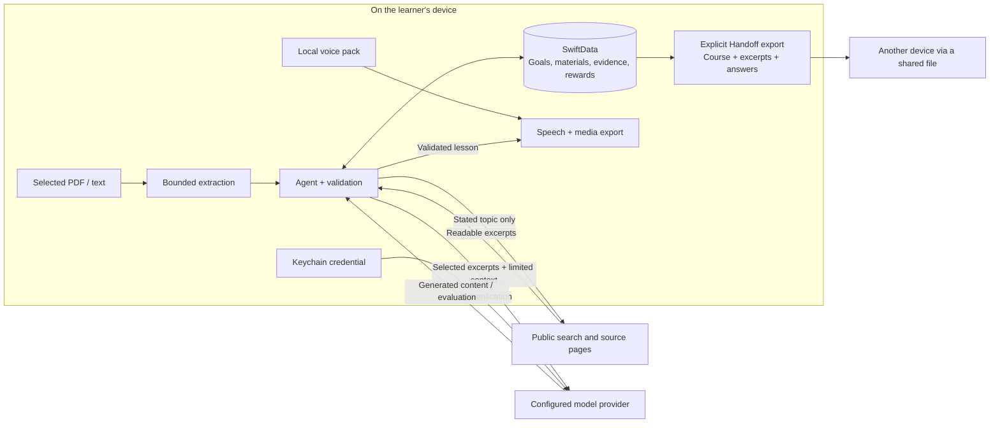

Local storage and local narration do not imply that model generation is offline. The model endpoint can be remote or locally hosted; the configured provider determines where its requests are processed.

- **Local application data:** Goals, materials, attempts, evaluations, interests and the reward ledger live in a dedicated SwiftData store. macOS uses `com.local.lumap`; iOS uses `com.local.lumap.ios`.
- **Secrets:** API credentials use the device Keychain. Endpoint/model preferences are separate from the credential. Keys are excluded from learning packages, readable exports and source files.
- **Material limits:** Imports are bounded to **25 MiB**, the first **40 PDF pages**, and up to **12,000 extracted characters per material**. There is no OCR in this version.
- **Remote model requests:** Selected excerpts, the learning goal and limited learner context are sent to the configured provider for the requested feature. Local storage does not mean model processing is always offline.
- **Public research:** The stated topic is sent to search sources. Uploaded private text and personal background are not used as public search queries.
- **Interest analysis:** Public-profile analysis reads publicly accessible page text after the user submits a URL. Login walls, access challenges and heavily scripted pages may be unavailable. There is no account-login bypass or background social crawler.
- **No continuous observation:** The current product does not capture screens, listen to the microphone, monitor other apps or continuously read browser history. History import is an explicit local action.
- **Portable learning packages:** Handoff includes course content, selected excerpts and learning answers. It excludes API credentials, provider configuration, personal background and reward balances. Review a package before sharing it.
- **Spatial capability:** The present AR interface is an interactive preview. It does not start a camera session, track a physical experiment, or depend on an unannounced Apple device API.

### How learning evidence is stored

The following is a **logical data map**, not an ER diagram of normalized database tables. `LearningGoal` is a SwiftData entity; its plan and session are encoded Codable snapshots. Their nodes, sources and attempts are nested data, not separate SwiftData entities.

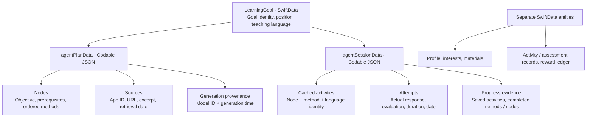

Source references link model output back to retrieved or selected material. Workspace Q&A also checks that cited quotes occur in the selected excerpts. Repeated saves do not duplicate an activity's reward, and importing a learning package does not import someone else's reward balance.

## Delivery status and roadmap

| Area | Available now | Next engineering milestone |
| --- | --- | --- |
| Adaptive teaching | Real research, topic-specific generation, mixed methods, saved evidence and next-section adaptation | Broader subject evaluations, accessibility improvements and stronger assessment calibration. |
| Teaching media | Multi-slide narration, retrieval quizzes, editable PPTX, MP4 and scripts | More layout choices, richer diagrams and more voice/language coverage. |
| Personalization | Explicit goals, confirmed interests and observed response/method evidence | Versioned decision logging, candidate masks and propensity contracts suitable for RL research. |
| LumaPath-RL | Mathematical specification and architecture | A consented dataset, trained/calibrated belief model, offline policy evaluation, then controlled deployment. |
| Spatial learning | Clickable visual concept previews | Actual AR session integration, task-specific visual evidence and device validation. |
| Cross-device continuity | Manual course-and-evidence Handoff | Account design and authenticated synchronization with conflict handling. |
| Incentives | Local reward ledger and demo allowance | Provider-usage accounting and separately designed redemption/fulfillment. |

The broad product ambition includes many ages, subjects and abilities. The present MVP does not establish universal pedagogical effectiveness, age-specific production suitability or physical-skill certification. Those require dedicated content, evaluation and delivery work.

## Project map

```text
.
├── Lumap.xcodeproj/              Committed project and shared schemes
├── project.yml                  XcodeGen source of truth
├── Lumap/
│   ├── App/                     macOS app, menu bar, floating Persona
│   ├── Models/                  SwiftData entities and validated learning contracts
│   ├── Services/                Agent, research, state, provider, media and exports
│   ├── GroundedStudy/           Source-grounded learning workflow
│   ├── Support/                 Localization and visual theme
│   └── Views/                   Native product screens and shared activities
├── LumapiOS/                    iPhone/iPad app and responsive views
├── LumapTests/                  XCTest coverage
├── DemoContent/                 Explicitly labeled synthetic sample material
├── VoicePacks/                  Manifest only; model weights remain local
├── Scripts/                     Voice installation and document build tooling
└── docs/                        Product design, technical design and evidence
```

Useful starting points for contributors:

| Concern | Source |
| --- | --- |
| Learning state and persistence | [`LumapStore.swift`](Lumap/Services/LumapStore.swift), [`LumapStore+LearningAgent.swift`](Lumap/Services/LumapStore+LearningAgent.swift) |
| Structured model contracts | [`LearningIntelligenceModels.swift`](Lumap/Models/LearningIntelligenceModels.swift) |
| Research and model planning | [`LearningResearchService.swift`](Lumap/Services/LearningResearchService.swift), [`LearningAgentService.swift`](Lumap/Services/LearningAgentService.swift) |
| Provider adapters and deadlines | [`LumapAIClient.swift`](Lumap/Services/LumapAIClient.swift) |
| Shared interactive activities | [`AgentLearningActivityView.swift`](Lumap/Views/AgentLearningActivityView.swift) |
| Narrated lessons and media export | [`NarratedDeckService.swift`](Lumap/Services/NarratedDeckService.swift), [`LessonVideoExporter.swift`](Lumap/Services/LessonVideoExporter.swift), [`LessonPresentationExporter.swift`](Lumap/Services/LessonPresentationExporter.swift) |
| Material workspace and Handoff | [`LumapStore+Workspace.swift`](Lumap/Services/LumapStore+Workspace.swift) |

## Project documentation

| Document | Purpose |
| --- | --- |
| [Product requirements](docs/Lumap_PRD.md) | Product vision, intended behavior and delivery scope. |
| [Technical design](docs/Lumap_Technical_Design.md) | Feature implementation and system contracts. |
| [Guided Study MVP](docs/Guided_Study_MVP.md) | Source-grounded, staged study workflow. |
| [Knowledge Studio / Inquiry design](docs/Knowledge_Studio_Inquiry_Mode_Design.md) | Document workspace and inquiry concepts. |
| [Natural voice integration](docs/Open_Source_Voice_Integration.md) | Kokoro, runtime assets and installation. |
| [Provider runbook](docs/Custom_Model_Provider_Runbook.md) | Model routing, setup and diagnostics. |
| [Recording script](docs/Lumap_Video_Demo_Script.md) | Suggested product walkthrough. |
| [LumaPath-RL architecture PDF](docs/pdf/Lumap_RL_Recommendation_Architecture.pdf) · [LaTeX source](docs/latex/Lumap_RL_Recommendation_Architecture.tex) | Research architecture and mathematical formulation; a target design, not shipped trained weights. |
| [System architecture PDF](docs/pdf/Lumap_System_Architecture.pdf) · [LaTeX source](docs/latex/Lumap_System_Architecture.tex) | LaTeX/TikZ design snapshot, including planned capabilities. The runtime diagram above describes the current implementation. |

To rebuild the architecture PDFs from their LaTeX/TikZ sources, install Tectonic and run:

```bash
brew install tectonic
./Scripts/compile-architecture-pdfs.sh
```

The default output is `docs/pdf/`. Set `LUMAP_PDF_OUTPUT_DIR` to use another destination.

The PRD and research documents intentionally cover a wider product vision than the shipped MVP. **Both architecture PDFs are historical design snapshots:** their “current MVP” passages describe an earlier baseline, including manual method switching and deterministic recommendations. Those passages are superseded by the current README and Swift implementation. Their target RL mathematics and future system diagrams remain design references.

The README's overview diagrams and narration chart are reproducible, code-native SVGs. Regenerate them from the repository root with Python 3; the chart reads the committed sample verification JSON:

```bash
python3 Scripts/generate-readme-diagrams.py
```

Mermaid diagrams and mathematical expressions render directly on GitHub. No trained RL weights, production cloud accounts, automatic cross-device sync, real AR supervision, provider billing reconciliation or physical reward fulfillment are implied by the target diagrams.

## Contributing

Start with a focused issue or pull request that describes the learner-facing problem. Keep macOS and iOS behavior aligned, preserve real source attribution, and add targeted tests when changing state transitions, provider contracts or learning evidence. Label demonstration-only behavior clearly. Never commit personal learning exports, provider credentials, model weights or local build output.

Lumap's current narrative and activity systems are independent native implementations. Third-party runtimes and downloaded model assets retain their own license terms; model weights are not redistributed in this repository.

## License and acknowledgements

Lumap's original application code is released under the [MIT License](LICENSE). Third-party libraries and downloaded model assets retain their own licenses and notices.

- [sherpa-onnx](https://github.com/k2-fsa/sherpa-onnx) provides the local speech runtime; the project pins version `1.13.8`.
- Kokoro provides the natural narration model, installed separately through the reviewed voice-pack installer.
- ONNX Runtime supplies the model execution backend distributed with the speech runtime.
- Public learning sources remain attributed in generated courses and portable teaching materials.

Please preserve upstream notices when redistributing dependencies or voice model assets.
