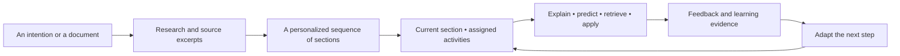
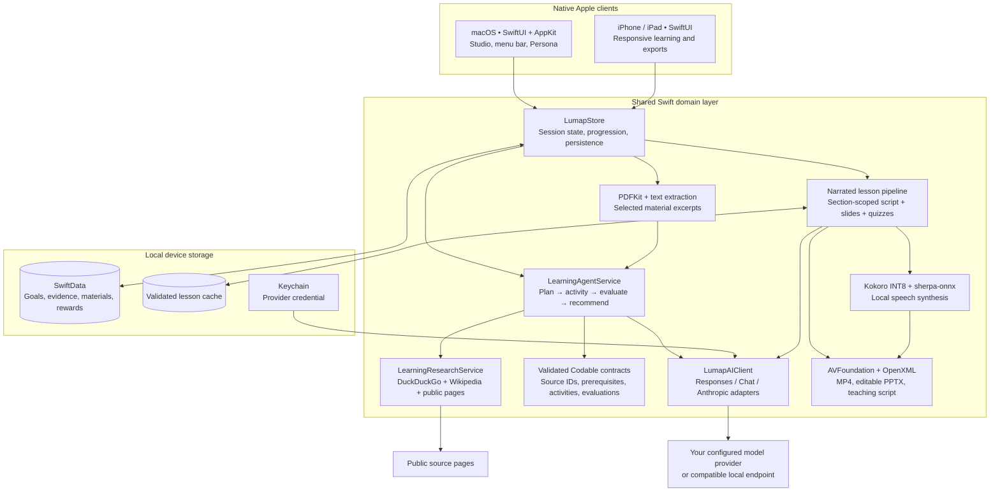

<div align="center">
  
  <h1>Lumap</h1>
  <p><strong>Follow your curiosity. Find your own way to understand.</strong></p>
  <p>A native, adaptive learning studio for Mac, iPhone and iPad.</p>
  <p>Built by <strong>Celestial Frontier</strong> for the University of Melbourne FEIT Hackathon.</p>
  <p>
    
    
    
    
  </p>
  <p><a href="#get-started">Get started</a> · <a href="#how-learning-works">Learning experience</a> · <a href="#architecture">Architecture</a> · <a href="#project-documentation">Documentation</a></p>
</div>

---

Lumap starts with a simple question: **What would you like to learn today?** You can name a topic, bring your own document, or explore an idea suggested from interests you have confirmed. The learning agent researches the subject, plans the necessary foundations, and turns the current section into activities that ask you to explain, predict, experiment and apply.

The aim is to help people discover what they want to understand—and make progress visible through evidence of understanding. The current product is a local-first MVP with real model calls, research, generated teaching materials, evaluation and persistence. The research architecture for a future trained reinforcement-learning policy is documented separately.

## How learning works



1. **Start with your intention.** A direct topic takes priority over recommendations. Upload a PDF or text file when the learning should be grounded in your own material.
2. **Let the agent prepare.** Public-topic research retrieves readable sources before course generation. The model receives the goal, available learning time, background, confirmed interests and relevant prior evidence.
3. **Focus on one section.** The agent assigns a small sequence of learning methods to the current section. Complete its activities before continuing; future section content stays out of the way. The number of sections depends on the subject and the learner.
4. **Make your thinking visible.** Explain a mechanism, choose a story branch, predict a counterfactual, solve a practice task or teach the idea back. The model evaluates the actual response and identifies specific gaps.
5. **Continue with a reason.** Results and misconceptions influence subsequent activities. Personal brings together saved projects, activity history, progress, feedback and rewards.

English is the default. Interface language and teaching language can be changed independently between English and Simplified Chinese. Both native targets currently use version **0.3.0 (build 3)**.

## Native on Mac, iPhone and iPad

<table>
  <tr>
    <td width="73%" align="center"><strong>macOS · a spacious starting point</strong><br /><br /></td>
    <td width="27%" align="center"><strong>iPhone · curiosity on the go</strong><br /><br /></td>
  </tr>
</table>

*Actual app captures from 30 September 2026. These discovery examples show starter suggestions; teaching content and subsequent section activities are generated by the learning agent. Earlier captures can differ from the latest navigation.*

## A real generated lesson

The image below comes from a six-slide photosynthesis lesson generated by the configured model from retrieved sources. It is an actual rendered lesson slide, not a product mockup.


The verified example contains **6 slides, 622 words of narration and 2 retrieval quizzes**. Its exported **1280 × 720 MP4 runs for 4 minutes**, including complete local Kokoro narration and pauses for questions. Beginning and ending audio were decoded and checked, and the last chapter was inspected visually.

Download the real [editable sample deck](docs/examples/photosynthesis-lesson.pptx), read its [complete teaching script](docs/examples/photosynthesis-teaching-script.txt), or inspect the [export verification metadata](docs/examples/photosynthesis-verification.json). Large video files stay outside the source repository.

In the app, narration advances after audio completion. A quiz appears at the relevant chapter boundary, pauses progression, and gives feedback before continuing. Seeking and pause/resume are supported. Saving completed-lesson evidence requires listening to every chapter and answering all included quizzes.

Three portable exports are available:

| Export | What it contains |
| --- | --- |
| **Editable PowerPoint (`.pptx`)** | Native editable slide text and shapes; complete teaching scripts, source attribution and quiz answer keys in speaker notes. |
| **Narrated video (`.mp4`)** | H.264 video, a complete AAC audio track, and question/answer cards with thinking time. Quizzes in exported video are pause-and-think prompts; interactive answering happens in the app. |
| **Teaching script (`.txt`)** | Every slide, full narration, quiz options, answer explanations and source labels. |

Lesson generation is scoped to the **current section**, and cache identity includes the course and section. A different chapter cannot silently reuse another chapter's lesson. Incomplete model output is rejected; a missing provider or timeout displays a retryable error.

## A repertoire of learning methods

The agent chooses methods for the section and the learner's observed needs. The catalog is a set of teaching tools, rather than a requirement for learners to select a pedagogical strategy themselves.

| Method | Interaction |
| --- | --- |
| Guided explanation | Build a concept in small, topic-specific steps. |
| Worked example | Inspect a concrete solution and explain the reasoning between steps. |
| Socratic dialogue | Work through questions with a model tutor grounded in the current lesson. |
| Analogy | Map a familiar situation to an unfamiliar concept and identify where the analogy breaks. |
| Visual concept map | Explore and edit relationships between generated concepts. |
| Branching story | Make choices in a topic-specific scenario; optionally use a local custom character portrait. |
| Flash recall | Attempt retrieval before revealing the answer. |
| Teach-back | Explain the concept in your own words and receive detailed feedback. |
| Simulation | Make predictions in a generated scenario and explain the effects of a change. |
| Deliberate practice | Work on a focused skill or misconception. |
| Reflection | Compare your initial understanding with your current explanation. |
| Misconception diagnosis | Challenge an incorrect claim and repair the underlying reasoning. |
| Curiosity branch | Choose a follow-up question, explain its connection to the current concept, and feed that evidence into the next section. |
| Counterfactual lab | Ask what would change if a condition or assumption were different. |
| Transfer challenge | Apply the idea to a new context. |
| Narrated lesson | Learn from a complete slide lesson with local narration and retrieval checks. |
| Spatial AR lab | Interact with a clearly labeled spatial concept preview. **Real camera-based supervision is not implemented.** |

Story mode is a native Lumap branching interaction inspired by the learning potential of visual novels. It is **not an embedded copy of the full upstream Paper2Galgame application**. Practical tasks and simulations currently use learner responses and model feedback; they do not independently verify a real-world experiment.

## Beyond the lesson

| Area | Working capability |
| --- | --- |
| **Discover** | Direct topic input, document learning, personalized topic suggestions and “not interested” refresh. |
| **Guided Study** | A staged, source-grounded learning workflow with questions, evidence and feedback. |
| **Knowledge Studio** | Select multiple imported materials or current course sources, ask questions with citations, and turn selected material into a course. |
| **Adaptive Path** | Inspect the current learning evidence, method observations, misconceptions and the reason for a next step. |
| **Interest profile** | Submit a public profile URL for readable-page analysis; confirm or remove the model's suggested interests. Import history for local aggregate suggestions. |
| **Handoff** | Export a validated course-and-evidence JSON package and import it on another device via Files or AirDrop. |
| **Personal** | Resume learning projects, review activity history and assessment results, and manage appearance and the reward wallet. |
| **Persona** | A macOS floating companion with current-course summaries, questions, another explanation and a learning timer. It appears when the main window is minimized. |
| **Rewards** | A persistent local ledger, duplicate-award protection and an unlimited demo learning allowance. Themes are unlocked. |

Handoff is an explicit file transfer, not automatic cloud synchronization. Persona responds to learning context inside Lumap; it does not watch the screen, browser or other apps. Provider billing and physical reward fulfillment are not connected to the local reward ledger.

## Architecture



### Research, planning and grounded generation

`LearningResearchService` normalizes a stated learning intention into a search query, queries independent public sources, fetches readable text and retains up to five deduplicated sources. Each excerpt carries a title, URL, retrieval time and app-assigned source ID. The model can cite these IDs; validation rejects references outside the retrieved set.

`LearningAgentService` produces structured course nodes with learning objectives and prerequisite relationships, then generates an activity for the active node. The app validates the returned structure before showing or saving it. Source text is treated as evidence rather than instructions. URL validation, redirect checks, time limits and bounded response sizes apply to research requests.

Uploaded-material courses use the selected excerpts directly. Private document text is not submitted as a public search query. The MVP uses explicit excerpts, not a vector database or full-document semantic index.

### Personalization and learning evidence

The runtime uses confirmed interests, background, available time, previous answers, rubric scores, misconceptions and method observations to condition the model. Local progression rules constrain the model's decisions and protect section ordering, prerequisite readiness and saved progress.

Activity evidence records the node and method, the learner's actual response, evaluation, timing and provenance. Saving an activity does not automatically mean mastery. Missing assessment evidence remains missing; repeated saves do not repeatedly grant rewards. Historical method scores are **observational signals**, not a demonstrated causal estimate of which method is best for a person.

**LumaPath-RL is a research design, not a trained model shipped in this MVP.** The LaTeX specification describes the intended state/action formulation, objectives and constrained recommendation architecture. Current adaptation is performed by model decisions plus local validation and evidence-based rules. The repository does not claim a completed offline training run or measured learning gains.

### Reliable generation and media

All model features share `LumapAIClient`: provider connection tests, planning, activities, tutor dialogue, evaluation, recommendations and material Q&A. It supports configurable endpoints and model IDs, rejects incomplete responses, and applies wall-clock deadlines with cancellation.

Narrated lessons require at least five slides and two valid quizzes. The generator requests a full spoken script per slide and makes one bounded repair attempt if the response fails its contract. Production generation never silently falls back to a fixed demo lesson. The overall narrated-generation deadline is 210 seconds, after which the learner can retry.

Kokoro runs locally through sherpa-onnx and ONNX Runtime. MP4 export renders constant-rate video frames and builds one continuous PCM master, including quiz thinking intervals, before encoding the final movie. Source media assets are retained for the whole export. PPTX export writes editable Office Open XML in a ZIP archive without a server dependency.

## Get started

### Requirements

- A Mac with **Xcode 26 or newer** and Command Line Tools for building the Swift 6 project.
- **macOS 14+** to run the Mac app; **iOS/iPadOS 18+** for the mobile app.
- Internet access for the initial pinned Swift Package resolution, public research and remote model generation.
- Your own model-provider account, or a compatible local endpoint.
- The optional local Kokoro voice pack for narration and narrated-video export.

```bash
git clone https://github.com/Ar1haraNaN7mI/LuMap---Celestial-Frontier.git
cd LuMap---Celestial-Frontier
open Lumap.xcodeproj
```

Choose the **Lumap** scheme and **My Mac**, then run. For mobile development, choose **LumapiOS** and an iPhone/iPad simulator or a configured physical device. Device deployment requires your own Apple signing setup. The iOS client has its own local data store; use Handoff when you want to transfer a course.

The generated Xcode project is committed. XcodeGen is only needed when changing `project.yml`:

```bash
xcodegen generate
```

### Configure a model

Open **Settings → AI provider**, choose a protocol, enter the endpoint and model ID, save your credential, and run the connection test.

| Setting | Supported behavior |
| --- | --- |
| Protocol | OpenAI-compatible Responses, Chat Completions or Anthropic Messages. |
| Endpoint | A provider base URL or the full protocol route. A `/v1` base is resolved to `/v1/responses` when Responses is selected. |
| Model | A model ID your provider actually serves. The current demonstration was verified with `gpt-5.6-sol` through the configured third-party gateway. |
| Credential | Stored in the device Keychain; never in the repository or course export. |
| Local service | A compatible loopback endpoint can be used without a key when the service permits it. |

The built-in demonstration defaults are `https://api.ikuncode.cc/v1`, Responses, and `gpt-5.6-sol`. These are configurable provider settings; a working account and available model route are required. Lumap does not include a shared API key or a free hosted model service. Provider-side quota and routing errors are surfaced in the app. See the [provider runbook](docs/Custom_Model_Provider_Runbook.md) for operational details.

### Install natural local narration

Lumap uses **Kokoro**, not the system speech voice. The large model assets stay outside Git and the app bundle.

On macOS:

```bash
./Scripts/install-kokoro-voice-pack.sh
```

The installer downloads a pinned official model archive, validates its size and SHA-256, and installs it into Lumap's sandbox Application Support directory. On iOS, import an already downloaded and extracted model folder in Settings. The app validates its required files before copying it into local storage. Reopen the narrated lesson after installation so its playback session detects the pack.

Without the voice pack, slides and the full script—including quiz prompts and answers—remain available; playback and narrated-video export clearly report that narration is unavailable. There is no hidden system-TTS fallback. The [voice integration document](docs/Open_Source_Voice_Integration.md) describes the model manifest, installation and platform details.

### Build from the terminal

```bash
# macOS
xcodebuild -project Lumap.xcodeproj -scheme Lumap \
  -configuration Debug -destination 'platform=macOS' \
  -derivedDataPath .build/DerivedData build

# iPhone / iPad simulator
xcodebuild -project Lumap.xcodeproj -scheme LumapiOS \
  -configuration Debug -destination 'generic/platform=iOS Simulator' \
  -derivedDataPath .build/iOSDerivedData build
```

The Mac build is written to `.build/DerivedData/Build/Products/Debug/Lumap.app`.

## Tests and a reproducible demo

```bash
xcodebuild -project Lumap.xcodeproj -scheme Lumap \
  -configuration Debug -destination 'platform=macOS' \
  -derivedDataPath .build/DerivedData test
```

Tests cover contracts and citations, course isolation, persistence, progression, evaluation evidence, duplicate rewards, provider routing, incomplete lesson rejection, presentation export and narration. Regular tests do not request paid model generations. A voice-rendering test runs only when the optional pack is installed; the full research/lesson/video test is explicitly opt-in.

A useful live walkthrough:

1. Configure a working provider and enter **“I want to understand photosynthesis.”** Allow research and planning to finish.
2. Complete the assigned activities in the current section. Include a misconception such as “most plant mass comes from soil,” then inspect the feedback and try a corrected explanation.
3. Continue only when the section is ready. Review the assigned method and the current learning evidence.
4. In a narrated section, play all chapters, answer the quizzes and export the lesson as PPTX, script or video.
5. Try a substantially different topic, such as **eigenvectors**, and compare its explanations, examples and sources.
6. In Knowledge Studio, select an imported document, ask a grounded question, inspect its citations and start a course from the selected material.
7. Review Personal, transfer a course through Handoff, then show the separately labeled AR concept preview.

The [video recording script](docs/Lumap_Video_Demo_Script.md) gives additional recording guidance. Older screenshots and design documents may depict earlier navigation; this README's behavior description follows the current implementation.

## Data and privacy boundaries

- **Local application data:** Goals, materials, attempts, evaluations, interests and the reward ledger live in a dedicated SwiftData store. macOS uses `com.local.lumap`; iOS uses `com.local.lumap.ios`.
- **Secrets:** API credentials use the device Keychain. Endpoint/model preferences are separate from the credential. Keys are excluded from learning packages, readable exports and source files.
- **Material limits:** Imports are bounded to **25 MiB**, the first **40 PDF pages**, and up to **12,000 extracted characters per material**. There is no OCR in this version.
- **Remote model requests:** Selected excerpts, the learning goal and limited learner context are sent to the configured provider for the requested feature. Local storage does not mean model processing is always offline.
- **Public research:** The stated topic is sent to search sources. Uploaded private text and personal background are not used as public search queries.
- **Interest analysis:** Public-profile analysis reads publicly accessible page text after the user submits a URL. Login walls, access challenges and heavily scripted pages may be unavailable. There is no account-login bypass or background social crawler.
- **No continuous observation:** The current product does not capture screens, listen to the microphone, monitor other apps or continuously read browser history. History import is an explicit local action.
- **Portable learning packages:** Handoff includes course content, selected excerpts and learning answers. It excludes API credentials, provider configuration, personal background and reward balances. Review a package before sharing it.
- **Spatial capability:** The present AR interface is an interactive preview. It does not start a camera session, track a physical experiment, or depend on an unannounced Apple device API.

## Project map

```text
.
├── Lumap.xcodeproj/              Committed project and shared schemes
├── project.yml                  XcodeGen source of truth
├── Lumap/
│   ├── App/                     macOS app, menu bar, floating Persona
│   ├── Models/                  SwiftData entities and validated learning contracts
│   ├── Services/                Agent, research, state, provider, media and exports
│   ├── GroundedStudy/           Source-grounded learning workflow
│   ├── Support/                 Localization and visual theme
│   └── Views/                   Native product screens and shared activities
├── LumapiOS/                    iPhone/iPad app and responsive views
├── LumapTests/                  XCTest coverage
├── DemoContent/                 Explicitly labeled synthetic sample material
├── VoicePacks/                  Manifest only; model weights remain local
├── Scripts/                     Voice installation and document build tooling
└── docs/                        Product design, technical design and evidence
```

Useful starting points for contributors:

| Concern | Source |
| --- | --- |
| Learning state and persistence | [`LumapStore.swift`](Lumap/Services/LumapStore.swift), [`LumapStore+LearningAgent.swift`](Lumap/Services/LumapStore+LearningAgent.swift) |
| Structured model contracts | [`LearningIntelligenceModels.swift`](Lumap/Models/LearningIntelligenceModels.swift) |
| Research and model planning | [`LearningResearchService.swift`](Lumap/Services/LearningResearchService.swift), [`LearningAgentService.swift`](Lumap/Services/LearningAgentService.swift) |
| Provider adapters and deadlines | [`LumapAIClient.swift`](Lumap/Services/LumapAIClient.swift) |
| Shared interactive activities | [`AgentLearningActivityView.swift`](Lumap/Views/AgentLearningActivityView.swift) |
| Narrated lessons and media export | [`NarratedDeckService.swift`](Lumap/Services/NarratedDeckService.swift), [`LessonVideoExporter.swift`](Lumap/Services/LessonVideoExporter.swift), [`LessonPresentationExporter.swift`](Lumap/Services/LessonPresentationExporter.swift) |
| Material workspace and Handoff | [`LumapStore+Workspace.swift`](Lumap/Services/LumapStore+Workspace.swift) |

## Project documentation

| Document | Purpose |
| --- | --- |
| [Product requirements](docs/Lumap_PRD.md) | Product vision, intended behavior and delivery scope. |
| [Technical design](docs/Lumap_Technical_Design.md) | Feature implementation and system contracts. |
| [Guided Study MVP](docs/Guided_Study_MVP.md) | Source-grounded, staged study workflow. |
| [Knowledge Studio / Inquiry design](docs/Knowledge_Studio_Inquiry_Mode_Design.md) | Document workspace and inquiry concepts. |
| [Natural voice integration](docs/Open_Source_Voice_Integration.md) | Kokoro, runtime assets and installation. |
| [Provider runbook](docs/Custom_Model_Provider_Runbook.md) | Model routing, setup and diagnostics. |
| [Recording script](docs/Lumap_Video_Demo_Script.md) | Suggested product walkthrough. |
| [LumaPath-RL architecture PDF](docs/pdf/Lumap_RL_Recommendation_Architecture.pdf) · [LaTeX source](docs/latex/Lumap_RL_Recommendation_Architecture.tex) | Research architecture and mathematical formulation; a target design, not shipped trained weights. |
| [System architecture PDF](docs/pdf/Lumap_System_Architecture.pdf) · [LaTeX source](docs/latex/Lumap_System_Architecture.tex) | LaTeX/TikZ design snapshot, including planned capabilities. The runtime diagram above describes the current implementation. |

To rebuild the architecture PDFs from their LaTeX/TikZ sources, install Tectonic and run:

```bash
brew install tectonic
./Scripts/compile-architecture-pdfs.sh
```

The default output is `docs/pdf/`. Set `LUMAP_PDF_OUTPUT_DIR` to use another destination.

The PRD and research documents intentionally cover a wider product vision than the shipped MVP. Trained RL weights, production cloud accounts, automatic cross-device sync, real AR supervision, provider billing reconciliation and physical reward fulfillment remain future work.

## Contributing

Start with a focused issue or pull request that describes the learner-facing problem. Keep macOS and iOS behavior aligned, preserve real source attribution, and add targeted tests when changing state transitions, provider contracts or learning evidence. Label demonstration-only behavior clearly. Never commit personal learning exports, provider credentials, model weights or local build output.

Lumap's current narrative and activity systems are independent native implementations. Third-party runtimes and downloaded model assets retain their own license terms; model weights are not redistributed in this repository.

## License and acknowledgements

Lumap's original application code is released under the [MIT License](LICENSE). Third-party libraries and downloaded model assets retain their own licenses and notices.

- [sherpa-onnx](https://github.com/k2-fsa/sherpa-onnx) provides the local speech runtime; the project pins version `1.13.8`.
- Kokoro provides the natural narration model, installed separately through the reviewed voice-pack installer.
- ONNX Runtime supplies the model execution backend distributed with the speech runtime.
- Public learning sources remain attributed in generated courses and portable teaching materials.

Please preserve upstream notices when redistributing dependencies or voice model assets.
