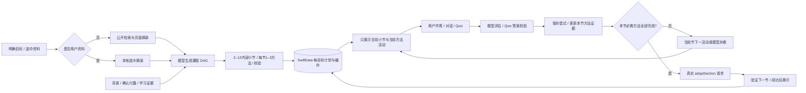
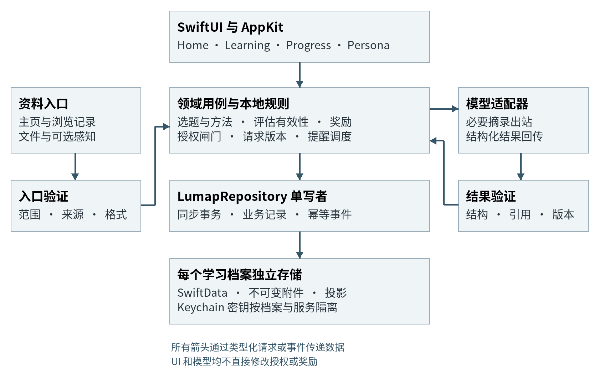

# Lumap 全功能技术设计文档

团队名称：**Celestial Frontier**

macOS 与 iOS 应用架构及逐项功能实现方案

版本 0.10　｜　2026 年 9 月 30 日　｜　对应产品需求 PRD 0.10、Lumap macOS/iOS 0.3.0

本文把 Lumap PRD 的 F01 至 F30 全部功能转为可供开发拆分的技术方案，面向 macOS、iOS、空间计算、AI、数据及测试开发者。每项功能说明数据与接口、执行流程、异常处理和验证方式；共用的数据约束与事件机制在前部定义，避免各模块独立实现后产生状态冲突。

建议采用 macOS 14 起的原生 SwiftUI 与 AppKit 应用，以 SwiftData 保存独立学习档案，通过可替换模型适配器生成内容。推荐规则、授权、学习状态、评分有效性、奖励和桌宠调度由本地程序控制。公开主页、浏览器记录、文件与可选画面感知通过独立适配器进入系统。

Lumap 已建立独立的原生 macOS 0.1.0 与 iOS 0.2.0 targets，已接入真实检索、模型生成与评估，并支持缓存内容的本地恢复；新生成与评分需要网络。本文同时承担两项职责：标明当前代码已经实现的行为及入口，并定义后续 H1 至 H4 的目标合同。逐功能章节中的完整协议、版本、策略和恢复流程仍是目标架构；若与“当前实现快照”不一致，以快照和应用界面明确标出的原型边界为当前事实。Lumap 不迁移 VoiceClass 数据，也不复用其 bundle identifier、数据库或密钥。

## 0.10 光链投影与本地视觉小说适配

`LearningJourneySnapshot` 从 plan/session 和真实游标生成只读投影，限定连续已完成前缀和实际当前节点。未来节点及总计划数不进入展示模型；缺失游标不会推断开放新的未来小节。`LearningJourneyChainView` 使用原生 ScrollView、Canvas 光束、Button 卡片及 30 fps 上限的缓慢 TimelineView。动画可固定相位以生成测试图片；系统/应用 Reduce Motion 或非活动场景会暂停摆动。

`LearningJourneyPresentation` 从当前 Store 或所选目标的持久化 plan/session 读取数据。当前卡片回原 Studio，历史卡片展示保存证据；回顾不调用 setMethod/selectLearningNode。Personal 与 iPhone 档案入口共用该视图。新课程首次完成编排及下一节正式进入时，Mac 可展示光链作为视觉进度入口；现有活动页及继续条件保留。

Paper2Galgame 的 `GameScreen.tsx` 与 `types.ts` 由本地安装器按固定 upstream commit 与 SHA-256 获取，只下载绘制器与类型。Lumap 原创 React 宿主桥接其打字、推进、Auto、Log 和本地立绘；Vite 构建后作为本地资源打包。WKWebView 使用非持久 WebKit data store、本地导航白名单和禁止联网的 CSP；供应商请求由 Swift 服务调用现有 LumapAIClient，Keychain 密钥不经过 JavaScript。

Native service 校验剧本行数、非空内容、允许表情与长度，使用 90 秒有限请求；任务身份与当前活动检查阻止迟到输出覆盖新课程。局部剧情续读文件按活动身份及语言隔离，补充材料沿用当前目标。原有活动回答、真实评分及保存链保持唯一权威；WebKit 的 progress 消息只能记录剧情行号，不能完成学习方法或解锁小节。安装器与本地运行时范围见 [接入说明](../Paper2Galgame/README.md) 与 [第三方来源](../Paper2Galgame/THIRD_PARTY_NOTICES.md)。

## 0.9 活动合同与证据一致性实现

`LearningAgentService` 对初始计划及下一节统一校验 1–3 个方法和主动练习，对各方法分别检查步骤、回忆卡、概念连接、选项与场景等必需内容。评估 JSON 同样验证分数、反馈及目标引用，最多进行一次有总时限的修复。`AgentLearningActivityView` 展示这些结构字段，评分时锁定输入，并在离开或主动停止时取消任务。

`evaluateActivityResponse` 在请求前后检查取消和上下文身份；尝试、回答、反馈及推荐理由的保存失败时恢复内存快照与 SwiftData。`completeGeneratedActivity` 必须找到当前 node/method/activity 的实际评估，不能仅凭可见反馈推进。补救按 attempts 的先后顺序判定：成功记录只能解决它之前的已保存失败。下一节点仅限当前顺序中第一个可进入节点。

课件回调和普通活动保存回调均为 throwing closure；macOS 与 iOS 必须在保存成功后才显示完成。`recordNarratedLessonOutcome` 校验完整且唯一的章节/Quiz 集合、选项及实际正误，只记录检测证据；成果保存成功再推进。缓存活动恢复自己的最新评估，不复用另一方式的反馈。

`LearningWorkspaceCodec` 验证完成前缀、当前游标、已保存评估与补救时间顺序，拒绝未来活动和跨节点活动 ID 复用；合法旧包可从证据推断缺失的方法完成字段。运行时方法切换同步保存 `currentMethodID`，重新打开资料与导出恢复共用该游标。工作区课程生成按原始目标、计划、语言隔离；来源列表去重并保留引用问答的问题。

`LessonPresentationExporter` 过滤 XML 非法标量而保留合法多语言字符；`LessonVideoExporter` 在渲染、混音与导出阶段响应取消，并清理本次生成文件。没有数据库 schema 或系统权限变更。验收命令、实测范围与供应商边界见[功能完整性更新](updates/2026-09-30-functional-integrity.md)。

## 0.8 本轮状态与恢复实现

`AssessmentSessionModel` 是 macOS/iOS 共用的检测展示状态：context 为 goalID/planID/nodeID/language，准备和评分任务分别维护 request ID。取消、换题和换上下文后不接受旧结果；实践提交必须包含预测、观察和修正，成功提交后的同一回答不能重复提交。Store 在真实评分返回后再次验证上下文及取消状态，并在同一 SwiftData 保存中写入评估、学习证据和奖励，失败时回滚。

`sectionAdaptationTask` / `sectionAdaptationRequestID` 使下一节模型编排可取消。旧任务的成功、错误和 defer 清理都受身份保护；`retryLearningGeneration` 根据本节完成状态把失败重试路由到下一节适配。`synchronizeLearningCompletion` 从真实已完成小节集合计算进度和 terminal status，并兼容恢复旧版 100% 但仍 active 的记录。

`LumapStore+Recommendations` 维护公开给主页的 `recommendationContextRevision` 和私有请求身份。资料/已确认兴趣、语言、供应商、课程导入/切换、已保存证据变化后失效旧建议；视图 `.task(id:)` 按修订刷新。失效自身不发网络请求。主动刷新取消并替代在途请求，避免响应倒序覆盖。

`NarratedLessonProgress` 将章节、听完集合、Quiz 回答和当前播放 UUID 收敛成可测试状态。未复核的 Quiz 阻止 seek；只有匹配当前 UUID 的音频完成回调可记入听完集合。课件证据 ID 使用 nodeID + deckID，避免不同章节因供应商重复 ID 合并奖励。AR 预览不再写入真实检测记录。

本轮结果、实际模型输出与复现命令见[功能优化验证记录](updates/2026-09-30-learning-polish.md)。原有 0.7 快照及后文长期架构保留，以上增补优先。

## 00 当前实现快照（0.7）

SwiftUI macOS/iOS 共用 `LumapStore`、SwiftData 和模型客户端。新增服务将过去固定样例替换为真实的检索—规划—活动—评估闭环。后文 F01–F30 保留目标架构；以下代码行为优先于早期原型描述。

| 功能 | 代码入口 | 当前实现 |
| --- | --- | --- |
| 资料检索 | `LearningResearchService` | DuckDuckGo 结果解析、Wikipedia 摘录与公开 HTTPS 文本抓取；限时、限制长度、拒绝不可用内容；返回真实来源 ID/URL/摘录 |
| 课程规划 | `LearningAgentService.plan` | 根据学习者背景、目标与资料输出 2–12 内部小节，每节初始 1–3 方法；验证 ID、先修顺序、方法与来源，最多一次合同修复 |
| 方法生成与反馈 | `LearningAgentService.activity/evaluate` | 15 个一般交互方式使用各自数据合同；活动 ID、来源、节点须匹配；反馈包含 0–100 分、误区、下一方法/节点和理由 |
| 状态编排 | `LumapStore+LearningAgent` | 每个目标持久化 plan/session JSON；缓存键为 node/method/language；UUID 和任务取消阻止旧主题请求覆盖新课程 |
| 顺序与自适应 | `continueLearningSection`、`LearningAgentService.adaptSection` | 当前节内按证据继续或补救；全部必需方法完成才真实请求模型适配下一节，校验后解锁；无训练后 RL 权重 |
| 引导学习 | `GroundedStudyView`、`MobileGroundedStudyView` | 与 Studio 共用当前小节和安排；增加来源查看及精确引文问答，不再固定四阶段或提供全部方法菜单 |
| 讲解与导出 | `NarratedDeckService`、`NarratedLessonPlayerView`、`LessonVideoExporter` | 5–8 页（通常 6 页）、完整讲稿、至少 2 个 Quiz；Kokoro 全文 WAV、AVFoundation 视频、脚本与 PPTX 导出 |
| 工作区 | `LumapStore+Workspace`、`LearningWorkspaceView` | 选中资料问答、来源引用、生成课程；真实进度/误区；JSON 学习包校验导入/导出；公开链接兴趣建议与确认 |
| AR | `SpatialLearning` / Future Lab 空间场景 | 保留可点击视觉演示、能力检测和 2D fallback，不启动相机或世界追踪 |
| 数据/奖励 | `LearningGoal.agentPlanData/agentSessionData` | 可选新增字段兼容既有目标；活动去重奖励，纠错可更新掌握度；演示额度无限，真实 token 计费尚未接入 |

### 当前推理调用链



`LearningSessionEvidence` 保存 activities、attempts、completedNodeIDs、savedActivityIDs，并用可选新增字段 `completedSectionMethods` 和 `currentMethodID` 保存每节方法完成记录与恢复游标。每次 attempt 记录 nodeID、activityID、methodID、回答、评分、误区、耗时和时间；不将个人信息或 key 写进课程包。评价提示绑定实际显示的问题，不能误用另一题答案。≥70 为当前形成性达标阈值，非经过外部校准的能力等级。本节全部必需方法形成达标证据才完成节点；模型指定补救成功可以解决对应失败项。第一次奖励与之后学习改进分开处理。

生成与评估只调用用户配置的服务。公开内容视作不可信证据而非指令；引用必须属于实际检索集合。私有材料课程不做公开搜索。网页抓取受登录墙、页面脚本、访问限制与摘录长度影响，失败可重试；不绕过平台访问控制。研究结果不等于自动事实认证。

完整课件合同拒绝只有一页、过短讲稿或缺少检测的输出。Quiz 在完整章节旁白结束时出现，避免随机定时器截断语句。音频和课程分别缓存；无语音包时显示缺失说明，不调用系统 TTS。导出视频是顺序教学媒体，不包含可点击的 Quiz，问题会以思考画面呈现。

测试按纯合同/本地数据库、真实供应商和媒体导出三层执行。单元测试不默认消耗 API；实时测试使用 Keychain 中的已有配置并独立运行。关键人工验收是直接输入不同主题/学习背景，查看当前小节、真实作答、同节补救及达标后的下一节适配；不通过手动方法选择器跳过流程，也不只检验 HTTP 状态。

### 顺序状态、超时和当前验证

`sectionMethods` 只暴露当前节点的安排；`completedCurrentSectionMethodIDs` 给出完成集合；`currentSectionIsComplete` 判定全部必需项；`canContinueLearningSection` 要求当前尝试已保存或当前方式已完成，并排除生成/评分/适配中的重复操作。`selectLearningNode` 与 `setMethod` 同时执行状态约束，不能只在视图中禁用按钮。

`continueLearningSection()` 在未完成小节内选择剩余或模型建议的补救方法。小节完成后才将最新回答、误区、方法观测和用户上下文交给 `adaptSection`，校验同一节点身份、先修关系与 1–3 个方法后更新内部计划并揭示下一小节。课程终点显示完成和个人进度入口。macOS、iOS、Guided Study、工作区和会话导入共用该状态，不存在第二套自由跳转路径。

结构化 plan/activity/evaluate/adapt 请求及最多一次合同修复共用 **90 秒墙钟预算**。`LumapAIClient` 同时设置网络超时并与墙钟任务竞速，取消传播到 URLSession；活动生成另有 **120 秒本地看门狗**，视图显示已等秒数、停止、错误和重试。通用问答、旁白与媒体导出有独立预算，不能把该参数当作整条检索/教学视频链的固定完成时长。

验证快照（2026-09-30）：60 项常规 macOS 测试，58 项通过、2 项 opt-in 真实服务/媒体测试默认跳过、0 失败；macOS 与 iOS 构建通过。独立真实测试验证了不同主题课程、正确/错误解释的不同反馈、双来源精确引用及资料课程。实际生成媒体清单 `dist/Demos/Photosynthesis-Verification.json` 记录 6 页、2 个 Quiz、622 词讲稿、约 240.82 秒视频、1 条视频轨及 1 条音轨；PPTX、全文讲稿和 MP4 文件均已导出。最新全套计数以最终交付测试日志为准，不将这些功能证据解释为训练后 RL 或长期学习成效。

最新在线活动复测使用已配置的 `gpt-5.6-sol` / Responses / ikuncode 路由，启用该供应商实测可用的较低 reasoning/verbosity 参数，一次真实 Visual map 生成约 33 秒成功。这是单次时延观测，不是服务等级承诺；Kokoro 与完整媒体导出另有独立真实运行验证。

## 01 技术基线与边界

### 技术选型

工程包含 macOS 14+ 的 `Lumap` target 与 iOS/iPadOS 18+ 的 `LumapiOS` target。Swift 6 工具链与依赖版本由工程配置锁定，功能可用性按最低系统验证；不能因为开发机 SDK 较新就直接使用新 API。两端以 SwiftUI 管主页面与状态呈现；macOS 使用 AppKit 管 NSPanel、文件对话框及窗口生命周期，iOS 通过 ARKit adapter 做能力检测并保留模拟回退。

UI ViewModel 明确标记 MainActor。领域 DTO 为 Codable 与 Sendable 值类型，服务用 actor 隔离共享可变状态；移植现有项目的 MainActor 默认隔离代码时逐项改造，不把 PDF 解码、检索排序或图片处理放在主线程。CPU 工作由有并发上限的工作队列执行，actor 只保证串行访问，不保证昂贵工作自动在后台高效运行。

SwiftData 存放权威业务记录、幂等事件及可重建投影；附件按内容哈希保存成不可变文件。每个学习档案使用独立 ModelContainer 与文件目录。首版不需要云端数据库、注册登录或独立 HTTP 后端；自定义远程 API 会发送经筛选的请求内容，因此“本地集成”表示应用与业务数据在本地，不等于所有模型推理离线。

| 层次 | 建议技术 | 选择理由与边界 |
| --- | --- | --- |
| 界面 | SwiftUI 和 AppKit | 原生桌面窗口与可访问性 |
| 状态与存储 | SwiftData 和 ModelActor | 独立档案与串行写入 |
| 文档 | PDFKit 和可选 Vision OCR | 页级提取并记录识别缺口 |
| 网络 | 独立抓取客户端与模型客户端 | 公共来源和自定义 API 使用不同策略 |
| 互动模块 | 原生渲染器和受限本地 WebView | 动作由预定义 schema 驱动 |
| 桌面感知 | NSWorkspace 和可选 ScreenCaptureKit | 应用事件与画面权限分开 |
| 密钥 | Security Keychain | 密钥不进文档数据库或网页桥接 |

ModelActor、SchemaMigrationPlan 及 ModelContext.transaction 均有 macOS 14 官方可用性说明。事务闭包为同步调用；网络与模型请求必须在事务之外完成，进入提交阶段再复核版本。[Apple ModelActor](https://developer.apple.com/documentation/swiftdata/modelactor)、[Apple 迁移计划](https://developer.apple.com/documentation/swiftdata/schemamigrationplan)、[Apple 事务接口](https://developer.apple.com/documentation/swiftdata/modelcontext/transaction(block:))

### 可复用代码与改造方向

当前 VoiceClass target 使用 Swift 6、macOS 14 和 SwiftData；Paper Tutor 另把设置、会话和材料写成 JSON 文件。Lumap 不复刻这两套数据来源的并行写入方式，统一由 LumapRepository 管业务记录，文件存储只保留附件、缓存与导出包。

| 当前文件或模块 | 已核对能力 | Lumap 改造 |
| --- | --- | --- |
| VoiceClassApp 和 PersistenceService | 模型容器、保存、验证记录读回 | 显式存储地址、版本迁移和单写者 |
| PaperTutorService 和 PaperTutorModels | 文件导入、课程、答题、追问、进度 | 分离课程、模块、产出、评估和事件 |
| PaperTutorAPI 和 KeychainStore | 多协议请求、密钥隔离、错误处理 | 能力声明、流式限额、结构化结果校验 |
| KnowledgeRetriever 和 LocalVectorizer | 词项哈希、关键词排序、来源限制 | 后台检索、分块索引和按档案过滤 |
| PaperTutorView 与 BRIDGE.md | 打包网页和原生消息桥接 | 受限模块协议，不开放任意动作 |
| PaperTutor 素材导入 | 本地图像读取与存储 | 独立 Persona 素材包和动画状态机 |

现有 LocalVectorizer 是 1024 维词项哈希表示，不能当作语义模型或用户学习效果模型。现有检索会取出候选分块后在内存排序；大规模资料需要单独测试索引策略。当前教学脚本有固定对话结构，不能通过增加一个 method 字符串就获得不同学习方式。

拟复用的第三方代码与角色资源需要核对来源。当前 PaperTutorWeb/THIRD_PARTY_NOTICES.md 记录上游及部分素材未提供明确再分发许可；Lumap 对外版本默认使用自行实现的渲染界面及原创或明确许可的 Persona 素材。这不影响复用已掌握的接口设计与处理经验。

## 02 工程结构与运行流程

### 工程和进程职责

现有 `Lumap.xcodeproj` 包含 macOS 与 iOS targets；H0 目前在单一工程中共享 Models、Services 与部分 Support 源码，边界稳定后再拆 Swift Package，避免演示阶段过度拆包。目标分层仍要求 Domain 不依赖 SwiftUI、WebKit 或具体模型厂商；Features 通过用例调用 Domain；Infrastructure 实现外部接口；Data 唯一持有可写 ModelContext。

各平台进程持有窗口／场景、当前档案、store 和调度器。解析工作可在受控后台任务中运行，失败不得拖垮主界面。Chrome 扩展及 native messaging host 在 H1 验证、H2 交付，为单独组件；host 只校验、转发已授权消息，不直接打开 SwiftData 数据库。当前 iOS target 已提供 ARKit 能力检测与 2D 回退；真正摄像头 renderer 和 visionOS target 仍作为后续独立适配器，不进入 macOS 构建链。



图中实线表示请求或事件数据流。外部来源数据经过入口校验后才能进入领域服务；模型只收到当前任务允许的数据副本，并返回待校验结果。UI、模型和浏览器 helper 均不能直接修改奖励或授权表。

### 共同依赖接口

```swift
// 接口草案 省略实现与非必要属性
protocol LearningUseCases: Sendable {
  func start(_ input: StartInput, context: RequestContext)
    async throws -> SessionSnapshot
  func next(_ sessionID: UUID, context: RequestContext)
    async throws -> ModuleSnapshot
  func submit(_ artifact: ActivityArtifact, context: RequestContext)
    async throws -> CommitReceipt
}
```

所有外部依赖都通过协议注入，包括 Clock、IDGenerator、ProfileFetcher、ModelClient、FileParser、ObservationSource、AssetStore 和 Repository。模拟对象只在测试或明确标记的 Demo 模式中注册，Release 正常学习不会在 API 失败后返回虚假课程。

### 从首页输入到进度更新

用户提交主题后，主线程即时显示提交中；Repository 先保存原始输入、目标版本及初始 Session，成功后马上进入 Learning Studio。导航只等待本地保存，不等待模型。Orchestrator 读取当前有效标签和资料，生成受约束的 InitialActivityPlan；模型返回后先校验 schema、引用及版本，再创建 ModuleInstance。若模型不可用，保留主题与会话，提供本地资料浏览或重试，不替换为其他推荐主题。

用户活动产出提交时，Repository 在同一事务中保存 Artifact、完成事件和应发的过程奖励。ProgressProjector 读取领域事件更新时间线；评分任务另建 AssessmentAttempt，仅用户主动进入检测才运行。活动完成后没有评分，也能显示“练习过”并得到过程奖励。

### 并发和任务生命周期

RequestCoordinator 按 profileID、taskKind 和 ownerID 管任务；相同交互槽只保留最新请求。用户换主题、撤销来源或切档案时取消相关 Task，同时递增版本。取消仅是资源优化；结果能否写入最终由 Repository 的版本检查决定，不能相信远程请求必然已停止。

模型生成默认最多两个并发槽，评分与当前活动优先于预生成；抓取建议每域一个连接、全局两个任务；OCR 首版一个工作槽。上限作为配置和压力测试参数，不写死在 UI。预取最多一个下一活动，来源撤销或目标变化立即失效，用户未开始前不计完成与奖励。

## 03 数据结构与接口合同

### 标识和请求上下文

持久 ID 使用 UUID；UTC 时间用于记录，单调时钟用于进程内间隔。DTO 的 JSON 键统一 lowerCamelCase；日期使用 ISO 8601 UTC，枚举使用稳定英文值。数据库模型不直接作为网络负载，不跨 actor 传递 @Model 实例。所有列表接口使用 cursor 和 limit，默认 50、上限 200，避免主线程无界加载。

```swift
struct RequestContext: Codable, Sendable {
  let requestID: UUID
  let profileID: UUID
  let profileEpoch: UInt64
  let goalID: UUID?
  let goalRevision: UInt64?
  let consentRevision: UInt64
  let inputRevision: UInt64
}
```

profileEpoch 在切换或关闭档案时递增，排除上一运行上下文；goalRevision 只在目标修改时变化；inputRevision 对应本次输入、推荐批次或模块草稿。consentRevision 为档案授权总版本，首版任一授权变化保守失效相关在途请求。每个任务还保存实际使用的 sourceID 和 sourceRevision；缓存命中和最终提交都检查来源仍有效。后台全局任务没有 goalID，不伪造当前学习目标。

### 主要持久实体

以下字段为最小领域模型；外键、状态组合、长度及跨档案关系在 Repository 中验证。复杂且只需整体读写的模块 payload 可存带 schemaVersion 的 JSON Data；用于排序、过滤或约束的字段单独保存。

| 实体 | 关键字段 | 约束 |
| --- | --- | --- |
| LearnerProfile | id ageBand interfaceLanguage learningLanguage accessibility revision | 年龄未知与资料缺失显式表示 |
| SourceBinding | id kind canonicalURL status sourceRevision | 个人来源与学习材料区分 |
| SourceItem | id sourceID authorID contentHash capturedAt | 同作者内容及哈希去重 |
| ConsentGrant | scope purpose enabled expiresAt revision | 逐用途逐来源撤销 |
| TagEvidence | topicID itemID kind strength observedAt status | 推测不覆盖明确纠正 |
| LearningGoal | id originalInput topicID goalRevision | 原话保留，版本单调递增 |
| ConceptNode 和 Edge | goalID conceptID relation revision | 前置图无环，设备条件分开 |
| LearningSession | id goalID state cursor revision | 可恢复，草稿不作完成 |
| ModuleInstance | id methodID version payload status | 已开始实例不被后台替换 |
| ActivityArtifact | id moduleID mediaRef assistance validity | 保存产出与辅助条件 |
| AssessmentAttempt | id category taskFamily rubricVersion status | 正式检测与普通练习分开 |
| MethodObservation | conceptID methodID taskFamily outcome | 缺失结果不记零 |
| DomainEvent | id type aggregateID payload sequence | 顺序可追踪，事件不可覆盖 |
| RewardEntry 和 Redemption | eventKey delta ruleVersion itemID | 单次事件与兑换唯一 |
| ProgressProjection | goalID revision lastEventSequence | 可从有效记录重建 |
| PersonaSession | id mode expiresAt scopes schedulerState | 不恢复过期观察 |
| JobRecord | id kind ownerID status context retryCount | 崩溃恢复时重新校验 |
| DependencyEdge | parentID childID purpose revision | 删除和撤销可遍历 |

每个实体记录 createdAt、updatedAt、schemaVersion；除 Profile 自身外均记录 profileID，作为独立目录之外的二次校验。SwiftData 关系 deleteRule 仅用于单纯所有权关系，不能盲目级联删除用户主动创建的学习成果。来源撤销通过 DependencyEdge 使推断、缓存和未来引用失效，保留独立成果与可解释的来源已移除状态。

### 唯一键与查询

F15 使用唯一字符串 eventKey，例如 profileID 与 sourceEventID 及 ruleVersion 的稳定组合，唯一属性只作为最后防线；先检查、计算余额和插入必须由同一 Repository 串行事务完成。SQLite 层的复合唯一索引不直接假设可通过任意 SwiftData schema 设置；必要时构造稳定单字段键。奖励规则升级不能给历史同一活动再次发奖，应另有跨版本 sourceEventID 发放约束。

首版使用 SwiftData FetchDescriptor 的谓词、排序与分页缩小结果，再在内存计算少量候选。缓存按 profileID、goalRevision、consentRevision、sourceRevision、policyVersion、locale 组成键。后续全文索引可独立使用 SQLite FTS，但它是可重建派生库，不直接操作 SwiftData 私有表结构；切换检索引擎需保持相同 Citation DTO。

### 模型请求与结构化响应

ModelRequest 包含 purpose、systemTemplateVersion、allowedSources、outputSchemaVersion、maxOutputBytes、deadline、modelCapabilities 和用户教学语言。密钥由 ModelClient 在发送时读入内存，永不进入上述 Codable 类型。模型只接收必要摘录及短历史，不发送整份行为日志或全部私人档案。

```json
{
  "schemaVersion": 1,
  "kind": "activityPlan",
  "methodID": "workedExample",
  "goalRevision": 3,
  "conceptIDs": ["concept-exposure"],
  "sourceRefs": [{"chunkID": "chunk-01", "page": 2}],
  "activity": {"prompt": "Explain the next step", "steps": []}
}
```

示例中的概念与分块 ID 是便于阅读的符号，实际值由应用生成或映射，模型不能创建任意数据库主键。通用验证顺序是字节上限、JSON 解码、字段和枚举、领域约束、引用属于 allowedSources、版本有效性、用户可见内容规则。未知 kind 或执行指令一律不执行。格式失败最多一次限定修复请求；再次失败回到可重试状态，不把宽松字符串解析结果当有效任务。

### 统一失败结果

DomainError 使用 code、retryable、userMessageKey、requestID 和 optional diagnosticID。稳定错误码包含 invalidInput、sourcePartial、sourceBlocked、permissionDenied、unsupportedCapability、providerUnavailable、credentialLocked、rateLimited、schemaInvalid、staleResult、storageFailed、cancelled 和 assessmentUnobservable。日志只记录代码、阶段、耗时及不含原文的对象 ID；界面显示可执行操作，不直接展示 provider 响应体或含密钥 URL。

429 和暂时网络失败最多两次带随机抖动重试，遵从可解析的 Retry-After 并受整体 deadline 限制；401、403、schemaInvalid、授权撤销不无限自动重试。可能已到达服务器的模型请求不保证计费层幂等，重试可能额外消耗；应用层 requestID 保证不会重复提交成果或奖励。

## 04 事务一致性和恢复协议

### 单写者与结果提交

每档案只有 LumapRepository 的 ModelActor 可以写入业务上下文，关闭自动保存并使用显式事务。MainActor ViewModel 持有 SessionSnapshot 等值类型，提交成功后订阅新快照；不依赖不同 ModelContext 在 macOS 14 上自动及时合并 UI 状态。模型调用、文件解码和 await 均不出现在数据库事务闭包内。

```text
result = await generate(snapshot, context)
validated = validate(result, snapshot.allowedSources)
repository.commit(validated, context):
  check active profileEpoch and owner inputRevision
  check goalRevision and consentRevision
  check every source revision is still allowed
  if completed(requestID): return existing receipt
  transaction:
    insert business records and domain event
    apply eligible process reward once
    insert pending projection jobs
    mark request committed
  on failure: rollback and return storageFailed
```

actor 在 await 处可以重入，所以“使用 actor”本身不解决过期结果；以上检查与同步写入之间不能再 await。任务开始前取得权限快照，发送前复核一次，提交前再复核一次；撤销后禁止新请求，但不能宣称已发送到第三方的字节被追回。

### 事件和投影

事实记录与 DomainEvent 同事务保存。ProjectionJob 只记对象 ID 和目标序号，不复制私密原文；消费者按 sequence 推进 lastEventSequence。处理至少一次，投影更新和游标提交同事务完成，以事件 ID 幂等。启动时重放 pending jobs，重复执行不能重复发点或重复计进度。普通 UI 事件不做全量事件溯源，权威业务记录仍可直接查询。

撤销和申诉不篡改历史尝试，而是新增 validity 状态和失效事件；投影只汇总有效证据。Rewards 过程点与 EvidenceBadge 分开，撤回证据会更新徽章，不能把诚实完成活动的过程点自动倒扣。

### 文件与数据库双写

文件与 SwiftData 没有跨系统原子事务。附件先解码验证并写入同卷 staging 临时文件，计算 SHA256 后原子移动到不可变对象目录，再提交数据库引用。数据库失败时产生的无引用对象由后台清理；提交成功的引用必须已对应完整文件。删除先逻辑标记不可用和停止引用，再排队删除文件，完成后更新清理状态。

启动时检查未完成 import、generation、assessment 和 deletion 工作。生成任务通常转换为 interrupted 供用户重试，不能在启动时默默恢复外部感知或大量付费请求；本地索引和清理任务可以低优先级继续。缺失附件标记 missing 并提供定位/重导入，不把缺失当空文档完成。

## F01 年龄与基本资料

### 数据与接口

使用 `LearnerProfile` 保存 `id: UUID`、`revision: UInt64`、`ageBand: AgeBand`、`interfaceLanguage: String`、`learningLanguage: String`、`background: String?`、`availableMinutes: Int?`、`accessibility: AccessibilityPreferences` 与时间戳。`AgeBand` 包含 `unknown`，不以空值表示成人；不默认保存生日。适配字段包括字号倍率、减少动画、文字替代及输入方式。自述技能另存 `SelfReportedSkill`，其 `verification = unverified`，不写入掌握证据。

`ProfileService.update(ProfilePatch, context: RequestContext, expectedRevision)` 接收字段级 `unchanged / set(value) / clear`，避免跳过表单清空旧资料。返回 `ProfileSnapshot` 或 `revisionConflict`。界面仅持有可发送的 DTO；SwiftData 模型只由当前档案的 `@ModelActor LumapRepository` 写入，ProfileService 不持有另一套写上下文。共同 `RequestContext` 用于关联档案、profileEpoch、授权与输入版本，档案修改另检查 `profileRevision`。

### 实现流程

H0 创建本地单档案，默认英文；非必要资料可跳过，未填写兴趣仍显示探索卡。`AdaptationPolicy.resolve(profile, contentCapabilities)` 输出内容范围、表达长度建议与无障碍限制，不输出能力等级。年龄未知只影响需要确认年龄的入口，不阻止普通基础学习。文本型背景最多 2,000 字符，学习时长接受 1–240 分钟或“不限定”；这些是配置初值。

保存后在同一次事务递增档案版本及相关 inputRevision，发布 `profileChanged`；仅使依赖相应字段的候选缓存失效。年龄、背景不改变当前用户已选主题；不符合内容访问条件时给可用替代。H0 起按每档案独立 ModelContainer 组织存储，H2 开放完整多档案界面；切换先递增 profileEpoch 并取消旧档案的抓取、Persona 和生成任务，再加载新快照，禁止仅替换导航标题而共享旧内存状态。共学者材料使用独立 `providedBy`，不能当作儿童自己的社交轨迹。

### 失败处理与验证

保存失败保留编辑草稿，不能创建空档案冒充成功；并发修订要求重新加载并保留用户尚未提交的字段。远程生成返回后再次检查 RequestContext 中所有相关版本，在同一次本地事务提交。年龄规则使用可替换的 `AgeEligibilityPolicy(version, jurisdiction, capability)`，上线前核实具体平台条件；用户没有社交账号仍可手动建立兴趣。

验证跳过全部背景、`unknown` 年龄、语言切换、共享电脑切换期间的迟到响应，以及键盘完成表单；关联 A03、A31、A37、A39、A40、A42。H0 只声称完成单档案；多档案和监护角色需独立验收。

## F02 粘贴个人主页与公开内容解析

### 数据与接口

`SourceBinding` 增加 `kind: personalProfile | learningMaterial`、`canonicalURL: URL`、`adapterID: String`、`authorID: String?`、`ownerDeclaration: Bool`、`status: SourceStatus`、`sourceRevision: UInt64`。声明属于自己不等于验证账号所有权。`PublicSourceConnector.inspect(url)` 返回 `SourcePreview`；`crawl(bindingID, budget, context: RequestContext)` 返回 `CrawlResult(items, coverage, failures)`。每个 `SourceItem` 带作者标识、发布日期、提取时间、正文哈希、规范链接及解析器版本。

### 实现流程

H0 使用少量经过验证的平台适配器，流程为地址解析、范围预览、用户确认、抓取、正文提取、去重和候选标签确认。由适配器从主页 ID 重建请求，不把用户 URL 原样传给另一解析器。只排队同作者的公开内容；域名相同不等于作者相同，无法验证作者时只保留主页简介。建议预算为近 90 天、最多 30 条内容、总计 30 次网络请求、60 秒、每页解压后 1 MiB、任务累计 20 MiB；robots、重定向与重试也计入请求预算。媒体默认只取允许访问的标题、简介和用户选择的字幕。

`PublicFetchPolicy` 只接受 HTTPS、443 端口及适配器允许的主机，拒绝凭据、IP 字面量、非公开地址及异常编码。每次请求和重定向均检查 DNS 的全部 A/AAAA 结果，阻止回环、私有、链路本地、组播及其他非全局地址；最多三次重定向，重新检查作者范围。DNS 预检之后普通 URLSession 重新解析仍有重绑定间隙，不能当作完整防护。建议独立抓取 transport 用 libcurl 的 `CURLOPT_RESOLVE` 固定已校验地址、保留原主机的 TLS 校验、关闭自动重定向及代理，逐跳重新建连；需 spike 验证打包、TLS 和实际连接地址约束。[libcurl 地址映射](https://curl.se/libcurl/c/CURLOPT_RESOLVE.html)、[重定向控制](https://curl.se/libcurl/c/CURLOPT_FOLLOWLOCATION.html)

抓取端不携带浏览器 Cookie、API 密钥或本地 API 权限；网页正文只作为不可信数据交给无工具的提取调用。先遵守站点抓取策略，静态 HTML/允许接口不能得到正文时标记 `partial` 或 `unsupportedDynamicPage`。后续动态渲染也必须约束所有子资源请求；在此能力通过验证前不启用任意网页脚本。缓存键包含来源、解析器、内容哈希及授权版本；默认手动刷新，可选每日更新使用 ETag/Last-Modified，不能延长原始摘录保留期。

### 失败处理与验证

状态为 `queued → checking → fetching → extracting → ready | partial | blocked | failed | cancelled`。登录墙、403、429、robots 拒绝分别说明原因；按 Retry-After 或指数退避处理，不切换身份或绕过登录。超时保存真实覆盖量，不产生虚构帖子。解绑递增 `consentRevision`、取消连接并让迟到输出失效。H0 允许明确显示不支持的链接并提供粘贴正文/文件入口，不能演示成全平台已通。

关联 A04、A05、A33、A34、A36、A42；测试同域他人帖子、恶意重定向、IPv6、DNS 重绑定、压缩炸弹、脚本空壳和撤销竞态。网络限制参照 [OWASP SSRF 防护](https://cheatsheetseries.owasp.org/cheatsheets/Server_Side_Request_Forgery_Prevention_Cheat_Sheet.html)；站点抓取策略参照 [RFC 9309](https://www.rfc-editor.org/rfc/rfc9309)。用户自定义本地模型地址使用另一套 `ProviderEndpointPolicy`，不会成为公开抓取的例外。

## F03 浏览记录导入与 Chrome 扩展

### 数据与接口

H0 定义 `HistoryImportDTO(schemaVersion: Int, records: [HistoryRecord])`，记录包含 `sourceRecordID: String?`、`url: String`、`title: String?`、`visitedAt: Date`、`isLocal: Bool?`。CSV 约定 `url,title,visitedAt` 列，JSON 使用版本化结构；时间统一转换为 UTC。`HistoryImportService.preview(file, range, excludedHosts)` 输出有效、过滤、重复及错误数量，`commit(previewID, context: RequestContext)` 才写库。最大 25 MiB、10,000 条、每批 250 条为首版配置；格式不符先展示映射或拒绝，不能假设各平台导出格式一致。

### 实现流程

用户选文件后限定日期与站点，先在本地规范 URL、移除追踪参数并从已知搜索引擎的查询字段提取主题；未出现的查询保持未知。持久化尽量保存主题、域名及按日汇总，原 URL 只在用户同意的短期原始区保留。记录哈希用于同源重复导入；浏览次数与停留时长不能直接证明兴趣或学习效果。

H1 原型验证、H2 交付的扩展采用 Manifest V3，运行时申请 `history`，独立声明 `nativeMessaging`，无需为了访问历史声明全部站点脚本权限。`chrome.history.search` 返回页面及最后访问时间；需要逐次访问证据时按范围调用 `getVisits`，不能把 `visitCount` 展开成虚构时间线。截断时标记 `coverage.truncated = true`。[Chrome history](https://developer.chrome.com/docs/extensions/reference/api/history)、[扩展权限](https://developer.chrome.com/docs/extensions/develop/concepts/declare-permissions)

通信链为扩展 service worker → Chrome 启动的签名 native host → 主 App 的受限本机 IPC。host 用 UTF-8 JSON 和四字节长度帧与 Chrome 通信，stdout 只写协议；清单 `allowed_origins` 固定扩展 ID，host 再核对调用来源；macOS host 路径必须绝对化，用户级清单安装到 Chrome 的 NativeMessagingHosts 目录。应用自限每帧 256 KiB，消息类型仅 `pair / status / importBatch / revoke`。Chrome 的 host 是独立进程，不能假设它能够直接访问主 App 的 SwiftData 或 XPC 对象。[Chrome native messaging](https://developer.chrome.com/docs/extensions/develop/concepts/native-messaging)

建议 IPC 使用只绑定回环地址的 NWListener。App 生成两分钟有效的配对邀请，含回环端口、随机 nonce 和一次性 256 位秘密；用户把邀请导入扩展并在 App 确认档案。双方用邀请秘密验证握手摘要，以 HKDF SHA256 和双方 nonce 派生配对密钥，分别保存到各自 Keychain，不依赖共享 Keychain。每次重连交换新的双向 nonce 并证明持有配对密钥，再派生连接密钥；消息包含 pairID、connectionID、档案、递增序号及 HMAC，按规范化字节编码计算。序号只在新连接从零开始，旧连接关闭后旧包无效。App 尝试恢复原端口，端口占用或配对材料丢失时要求重新配对；host 不扫描本机端口寻找任意服务。只开放白名单命令，不接收 shell、任意路径、URL 代理或 SQL。此为待实现方案，签名、公证、沙盒网络权限、Chrome host 清单安装及升级迁移必须先完成 spike。[Apple NWListener](https://developer.apple.com/documentation/network/nwlistener)

### 失败处理与验证

主 App 退出即停止接收，扩展不自动重启 App；默认丢弃未发送的新事件并显示缺口，避免隐形长期缓冲。批次使用 `pairID + batchID` 幂等提交，授权撤销使密钥与当前配对失效。浏览器删除历史后，若对应绑定允许同步删除，则根据 `onVisitRemoved` 清理其派生记录；离线间隔后执行一次范围对账。文件导入与实时订阅是两个独立开关。

关联 A31、A32、A33、A36、A42；测试拒绝权限、主 App 未启动、超大/坏帧、非法来源、重放、重复导入、删除传播及不同档案隔离。H0 不读取 Chrome 私有 SQLite 文件；扩展未交付时只显示文件导入可用。

## F04 带来源的标签与可撤销画像

### 数据与接口

`TagEvidence` 保存 `id: UUID`、`topicID: String`、`sourceID: UUID?`、`itemID: UUID?`、`kind: selfReport | confirmation | contentInference | activitySignal`、`strength: Double`、`observedAt: Date`、`expiresAt: Date?`、`status: active | disputed | revoked`、`extractorVersion: String`。`ProfileTag` 是可重建投影，包含得分、支持证据 ID、冲突和 `profileModelRevision`；当前目标、方法效果、薄弱点各有独立实体，不能合进一个 tags 字符串。

接口为 `ProfileEngine.propose(items, taxonomyVersion, context: RequestContext)`、`confirm(tagID)`、`correct(tagID, replacement?)`、`rebuild(affectedSourceIDs)`。候选输出是严格 JSON，包括 `topicID`、`evidenceItemIDs` 和简短解释；引用不在输入集合、主题不在允许词表、或正文不支持的候选被拒绝。无外部模型时只用手动兴趣及本地已实现的规则，不生成假画像。

### 实现流程

H0 使用透明规则。显式兴趣及用户纠正按优先规则处理，不靠自动证据“投票”覆盖。推测权重初值：用户反复主动主题选择 0.55、公开自述主题 0.35、一般帖子 0.20、应用类别 0.05；这些仅为排序启发参数，不是兴趣概率。自动信号乘以 `2^(-ageDays / 30)` 衰减，同一内容哈希只计一次；每来源每主题每日强度截断为 1，避免高频转载刷权重。自动主题支持量可用 `1 - exp(-sum(weight × decay))` 压到 0–1，但界面不称其为置信概率。

LLM 仅负责把允许的摘录映射到受控兴趣主题，不能推断敏感身份、智力或诊断；例如阅读健康内容只支持“正在探索相关知识”。冲突保存原始依据，用户主动目标由 F05 单独优先。只停用来源立即将其证据移出新推荐；删除则沿 `source → item → evidence → projection → recommendation reason` 依赖清理。已确认兴趣只有用户选择保留时才另建自述证据。

### 失败处理与验证

状态包含 `unknown / inferred / confirmed / corrected`；证据不足显示未知。每次重算递增投影版本，候选缓存随之失效；撤销中的旧模型结果即使请求已发出也不能入库。删除任务记录游标和受影响 ID，重启可继续；共享内容对象采用引用计数，防止删除一来源误删其他仍有效来源，同时保证被删来源不再参与解释。

H1 再引入经过验证的语义分类与校准，不替换用户纠正优先规则。关联 A06、A25、A33、A34、A42；验证转载重复、相互矛盾来源、来源全部删除、模型伪造出处，以及一次点击不能被解释为长期确定兴趣。

## F05 明确主题直接进入学习

### 数据与接口

`StartLearningCommand` 包含 `input: text(String) | card(courseID: UUID, version: Int)`、`learningLanguage: String`、`requestedMinutes: Int?`、`attachmentIDs: [UUID]` 和请求信封。`LearningGoal` 同时保存不可变 `originalInput`、用户选择的 `topicID?`、`title`、`goalRevision`、`provenance: explicitText | selectedCard`。`LearningStartService.start(command)` 先返回本地 `SessionHandle(sessionID, goalRevision)`，再用事件流返回初始内容；导航不等待主页解析、推荐或模型调用。

### 实现流程

MainActor 接收提交后禁用同一提交动作的重复触发，以 `requestID` 做幂等键。Repository 事务内建立目标与会话，状态设为 `preparing`，提交成功即进入 Learning Studio。用原话显示目标和可取消的准备状态；本地已知主题可直接提供首个导入活动。主题宽泛但可识别时，例如“摄影”，先展示摄影概览，不在首页逼用户重新选兴趣。

`TopicResolver` 只做术语归一及资料关联；模型只能返回 `recognized(topic)` 或 `needsClarification(question)`。它不能根据画像替换用户主题，也不能在主题归一时提高任务风险或改为其他课程。真正无法识别时，在已建立的会话内问一个短问题，允许继续编辑。完成解析后调用 `LearningPlanner.bootstrap(goalSnapshot)`；兴趣标签只用于该主题内的例子，不改变主题 ID。

用户改目标时递增 `goalRevision` 并取消旧生成任务；已完成活动保留原目标快照。流式内容分块携带原请求版本，前端和 Repository 都检查当前 `sessionID + goalRevision`。提交后再次点击同一按钮返回同一 SessionHandle；用户明确发起新学习则生成新 requestID。H0 完成文字与卡片启动；语音仅在转写内容由用户确认后走同一入口。

### 失败处理与验证

数据库写入失败保留原输入，不先跳转到不存在的会话。无网或 API 未配置时仍可进入主题工作区、查看已有资料和离线活动；显示生成不可用，不把空页伪装为生成完成。API 超时保持当前目标和草稿，重试产生新生成 requestID，但不重复创建目标。初始生成失败只更新 `contentStatus`，不删除已创建会话。

关联 A01、A02、A09、A35、A36。测试摄影兴趣画像下输入木工、宽泛主题、快速双击、连续修改主题、进入过程中切换档案与乱序流式回包；断言最终目标来自用户最近的明确操作，且请求失败不会把用户送回推荐首页。

## F06 猜你想学与换一批

### 数据与接口

`RecommendationCard` 保存稳定 `courseID`、`courseRevision`、`topicID`、具体成果、预计分钟、可用方法、`reasonCode` 与 `evidenceIDs`；标题不是身份。`RecommendationBatch` 保存 `batchID`、`generation: UInt64`、`profileModelRevision`、`catalogRevision`、卡片 ID 与实际曝光时间。接口为 `TopicRecommender.nextBatch(input, excludingIDs, context: RequestContext)`、`recordImpression(batchID)`、`feedback(cardID, kind)`。

`FeedbackKind` 区分 `refreshBatch`、`lessTopic`、`tooEasy`、`tooHard`、`alreadyKnown`。换批只对本次实际曝光的内容建立短期负反馈；主题级排除需要用户明确选择。用户选择“不感兴趣，换一批”不会自动开启任何抓取任务。

### 实现流程

H0 候选来自带版本的可用内容目录，加上通过 schema 和内容能力检查的生成候选。先过滤年龄、设备、无障碍和用户永久排除主题，再按 `0.45 × interest + 0.25 × goalFit + 0.15 × timeFit + 0.15 × novelty` 排序；缺失维度在可用维度间归一，没有个人证据则采用标记为探索的均衡候选。以上为可调设计值。展示四张卡时尽量保留两个以上主题，除非用户已限制领域；推荐理由必须引用实际参与排序的依据。

按稳定 courseID 维护最近 20 张真实曝光卡片的环形缓冲，同一轮探索不重现；本次换批内容增加 24 小时软降权，跨会话参数后续验证。`nextBatch` 基于快照计算；新批次 ready 后一次替换卡片，输入框状态由独立 ViewModel 保持。第三次连续换批可显示可忽略的偏好选择。

缓存键为档案、画像版本、目录版本、语言、时间条件、排除集哈希及曝光游标，默认十分钟 TTL。来源更新不覆盖正在输入或已点击的卡片。刷新递增 batch generation，迟到批次不提交；点击动作闭包捕获具体 `courseID + courseRevision`，立即发送 F05，不按后来列表下标取值。

### 失败处理与验证

不足四张时返回 `partial` 与真实数量，零候选返回 `exhausted`，可扩展主题或恢复旧建议；不能给同一课程换标题冒充新内容。请求失败保留上一批和重试按钮；相同刷新 requestID 不重复记负反馈，未实际曝光的候选不进入最近 20 张集合。H1 可引入更丰富的内容召回，刷新和幂等规则仍由本地应用执行。

关联 A03、A06、A07、A08、A09、A33、A36。固定随机种子验证排序解释一致；测试小目录耗尽、三次刷新、双击刷新、刷新中点卡、撤销来源后缓存失效，以及明确排除主题不会在换批后重新出现。

## F07 顺序小节、内部图谱与恢复

### 当前数据与接口

`LearningCoursePlan` 保存真实来源、模型信息、2–12 个内部 `LearningPathNode`；节点保存稳定 ID、具体目标、前置 ID、预计时间与初始 1–3 个 methodID。plan 的内部结构为编排所需，不在用户界面展示完整未来目录。

`LearningGoal.agentPlanData/agentSessionData/agentNodeID/agentLanguageCode` 保存计划与会话。session 中的 `completedSectionMethods`、`currentMethodID`、活动缓存、尝试与已完成节点共同决定恢复位置。语言是缓存键的一部分，恢复不能误用另一个目标或语言的活动。

### 执行流程

进入目标后检索并验证计划，只展示当前小节。`LearningAgentPathView` 显示已完成标题、当前标题/目标与未知下一步占位，不显示总节数或节点按钮。`LearningSectionMethodsView` 只显示本节方法的 current/done/pending 状态。`LearningSectionContinueView` 是统一继续入口，没有自由方法选择器或 Prefer This。

保存有效尝试后，根据反馈继续本节；低分使用模型指定补救，仍留在当前节点。全部必需方式完成后，`continueLearningSection` 找到先修条件满足的下一内部节点，实际调用 `adaptSection` 重写目标与方法安排。只有响应验证成功、目标/计划/当前节点仍匹配时才推进。重复点击、异步迟到或主动取消不能跨节。

### 失败与验证

失败保留已保存证据和当前节点，显示错误与重试；不得静默删除前置、绕过完成条件或显示固定成功内容。新目标建立独立记录，不改写旧项目。导入会话校验版本、大小、节点顺序、引用及方法状态，再恢复同一顺序门槛。

覆盖 A10、A11、A14、A36、A48–A51、A57–A59：未完成不能跳节、低分留在当前节、成功补救、全部必需项完成后真实适配、迟到结果隔离和重启恢复。图谱编辑、精细版本迁移及长期掌握度校准属于后续扩展。

## F08 Learning Method Modules 活动框架

### 当前合同与渲染

`LearningGeneratedActivity` 保存 id、methodID、nodeID、title、explanation、prompt、steps、examples、choices、cards、concepts、connections、hints 与 sourceIDs。结构验证与每种方法的语义要求共同约束内容；模型不能返回可执行 SwiftUI、HTML 或脚本。活动输入绑定真实课程来源和当前小节目标。

| 方式 | 当前真实交互与学习证据 |
| --- | --- |
| Guided explanation | 分段理解具体知识后回答当前问题 |
| Worked example | 预测再逐步揭示例题，提交推理 |
| Socratic dialogue | 带上下文的真实模型问答与追问 |
| Analogy | 解释模型生成的具体映射和失效边界 |
| Visual map | 编辑概念连接并说明关系 |
| Story | 本地嵌入上游 Paper2Galgame GameScreen，原生模型/资料适配、自定义角色、剧情续读与原有评估流程 |
| Flash recall | 揭示前记录回忆，再逐卡核对与评估 |
| Teach back | 用户独立讲解，由模型指出遗漏/误区 |
| Simulation | 对当前主题的条件变化提出预测并解释结果；不把语言生成称为物理仿真器 |
| Deliberate practice | 针对微技能尝试、反馈和修正 |
| Reflection | 联系理解、不确定性与下一行动 |
| Misconception diagnosis | 识别具体错误模型并给出修正 |
| Curiosity branch | 对当前概念的问题分支形成探索证据；不跳过安排去未来节点 |
| Counterfactual lab | 改变一个假设，预测并比较影响 |
| Transfer challenge | 在新情境应用同一概念并说明推理 |
| Narrated lesson deck | 被安排到当前节时生成 5–8 页、全文旁白及 Quiz，完整听取与回答后保存 |
| Spatial AR | 独立视觉预览，不属于常规学习顺序，不贡献真实操作掌握证据 |

### 选择与完成

16 种非 AR 形式是模型可用能力目录，不是给用户自由切换的菜单。每节初始安排 1–3 种，失败时可添加补救。原生 renderer 保持不同输入及产出语义；两端活动页跟随 `currentMethod` 更新，叙述课件和一般活动之间切换也由同一状态驱动。

保存调用 `completeActivity`，评估针对实际题目；奖励按活动幂等。本节方法完成状态只由达标证据更新，单纯打开、字数足够或随意保存不能解锁下一小节。ActivityRecord、attempt、方法完成记录及当前方法游标共同支持恢复。

### 边界与验证

未知方法、坏引用、不完整合同和过长响应报错，不能用相同固定内容换标题。校验评估问题与活动一致、揭示前回忆保留、剧情/概念图输入真实、模型失败显示错误，以及非当前方法调用无法绕过顺序。通用沙箱代码执行、可编程物理模拟器和跨领域实验精确性为后续能力。

## F09 方法适配与薄弱方面

### 当前输入和决策

`learnerContextForGeneration` 聚合主动目标、教学语言、年龄段、背景、时间、已确认兴趣、方法得分观察和具体误区。偏好与表现分开；来源兴趣不能证明方法效率，样本平均分也不是因果估计。

初始 plan 按内容与学习者给出每节 1–3 个安排。每次 `evaluate` 返回实际题目的反馈、误区、下一方法/节点和理由；本地门槛阻止低分跨节。当前节安排完成后，`adaptSection` 根据最新证据真实请求模型修订下一节，而不是直接读出最初草案。

### 用户控制与失败

用户可以表达太难、需要例子或通道不可用，作为模型安排的约束；不提供固定方法按钮、全部方法下拉框或未来节点入口。低分触发同节补救，成功补救可解决对应失败项，避免无限重复同一种格式。网络失败和未回答不计学习失败。

未来可加入条件匹配的 `MethodObservation`、延迟保持和反事实评估，达到足够证据后训练策略。当前没有可宣称的方法效率因果结论或训练后 RL。验证当前支持需求进入下一次调用、低分不越级、补救后状态一致，以及资料/目标修改后旧响应不覆盖新会话。

## F10 可选检测入口与会话控制

### 数据与接口

`AssessmentOffer` 包含 `category: theoretical|practical、purpose、durationEstimate、allowedAids、evidenceScope`；`AssessmentSession` 包含 `attemptID、returnRoute、status`。状态为 `offered → preparing → inProgress → submitted → reviewed`，并允许 `skipped、cancelled、interrupted`。`AssessmentCoordinator.start(offer:context:)` 显式创建尝试；`skip(offerID:)` 只记录可选入口反馈，不创建零分尝试。理论和实践分别存储，不能通过同一 `passed` 布尔字段覆盖两者。

### 实现流程

Learning Studio、会话回顾及个人页均能打开 Assessment Hub。开始前显示量规概览、辅助与观察范围；只有用户点击开始才启动题目或摄像头流程。进入检测先保存当前模块草稿和返回路由；退出后恢复原活动，不启动其他推荐主题。主动提交才进入评分队列；普通练习和 Persona 回答永远不会隐式转为正式检测。

正式检测结果不构成额外导航门槛，跳过不写零分或减少过程奖励；但当前小节的必需活动仍由 `canContinueLearningSection` 约束，不能把跳过 Assessment 解释成可跳过学习安排。题目针对当前小节实际任务；理论和实践记录独立，不复制分数，也不通过切换检测类型改变当前方法游标。

### 失败处理与验证

评分服务失败时保存 `submittedPendingReview` 和作品，不阻塞继续学习。检测中断保存草稿，恢复时校验任务及量规版本；版本变化需用户选择重新开始，不能悄悄换题继续原评分。对重复提交使用 `attemptID + submissionRevision` 幂等键；同一提交只排一个有效评分作业。验收 A15、A16、A21、A22、A36：自动化走完整“全部跳过→下一活动→进度→过程奖励”路径，确认无成绩门控、无负分及无强制摄像头请求。

## F11 Theoretical 理论检测

### 数据与接口

`TheoryTask` 固定 `taskID、taskFamilyID、conceptIDs、prompt、rubricVersion、criteria、referenceRefs、criticalErrors`。每个 `Criterion` 声明 `required、applicable、anchors[0...2]`；结果用 `CriterionResult(score: Int?, reasonCode, answerSpanRefs)`，未答、不适用或无法判断时 `score = nil`，不借 0 分表达缺失。`TheoryEvaluator.evaluate(task:submission:)` 返回逐维结果、证据及 `decision: sufficient|insufficient|undetermined`，评分提示与量规 hash 在看答案前固定。

### 实现流程

提交包含原回答、输入方式、辅助事件、是否见过答案及提交版本。H0 先用受控题及审核量规；可确定的题使用规则检查，开放题让模型输出严格结构，再由程序校验维度、分数范围和引用是否确实存在于回答。合理不同观点按概念、论证、迁移边界评分，不能以字符串相同为通过条件。

必要维度 N/A 时不计算总分或达标。只有当前模板三维均适用且完整时才应用示例 `sum(scores) ≥ 5 && !criticalError`；领域专属模板声明独立规则，分数不跨域相加。证据徽章要求同概念不同题族的两项独立有效尝试，至少一项有解释或迁移；已看答案、重复题或相互泄露答案的尝试仅作练习。Repository 同次保存评分版本及事件，徽章由证据集合投影，不由模型直接发放。

### 失败处理与验证

模型断言缺乏回答引用、维度遗漏或评分互相矛盾时置 `undetermined`，提供替代题／人工复核。申诉即冻结本次结论，追加修订记录而非覆盖旧评分；删除尝试重算徽章与方法趋势，过程点保留。验收 A17、A21、A22、A42；覆盖多解、空回答、仅两维适用、关键错误、同题重做、两项真正独立证据及评分重试，确保 N/A 不触发错误能力结论。

## F12 Practical 实践检测

### 数据与接口

`PracticalTask` 保存 `environmentType、requiredSteps、resultConstraints、adjustmentPrompt、allowedTools、rubricVersion`。证据为 `PracticalEvidence(source: simulator|artifact|camera|selfReport, eventRefs, artifactHash, visibility, confidence)`；`PracticalResult` 分开记录过程、结果、调整及每项关键步骤。`PracticalEvaluator.evaluate(task:evidence:)` 依据任务规则返回满足、未满足或不可判断，不能把自报和模拟器遥测标成同一种证据强度。

### 实现流程

H0 用一个原生变量实验：用户先预测，修改参数，提交观察，再解释一次调整。模拟器记录 `sequence、action、beforeStateHash、afterStateHash、simulatorVersion`；评分器重放事件，验证允许操作及关键步骤顺序，检查目标状态，并用用户解释评估调整依据。过程规则可以是依赖图而非唯一动作顺序，允许不同有效解法。作品任务读取用户选择的文件副本和约束检查结果；“文件已上传”只表示提交，不表示作品质量合格。

任务为三个维度分别配置 0–2 级锚点、必需项和达标规则；未观察到必须步骤时无完整达标结论。新重试创建子 attempt 并引用前次尝试，保留已经获得的提示；看过示范后的成功仍可记学习成果，但不能伪装未经辅助的独立实践能力。完成结果与证据引用在单次保存中提交，后续进度和证据徽章由事件处理。

### 失败处理与验证

缺帧、摄像头遮挡、模拟器事件缺序、损坏作品分别返回观察不足／日志不完整／文件不可读，不统一判用户失败。中断可转手动记录，保留新的证据来源标签；文件修改后 hash 不符需重新评估。涉及代码的测试只使用 F08 受限执行器，H0 无运行能力时不可捏造测试通过。验收 A18、A19、A21、A42；校验同结果不同有效过程、关键步骤遗漏、重放确定性、超范围观察及申诉后撤回派生结论。

## F13 实验模拟 视觉辅助与真正 AR

### 数据与接口

当前共享层定义 `SpatialLearningProviding`，暴露 `availability、scenario、prepare、reset`；`SpatialLearningAvailability` 区分 `checking、previewOnly、ready、unavailable`。iOS 的 `MobileARKitProvider` 在真机读取 `ARWorldTrackingConfiguration.isSupported`，Simulator 固定回退为 `previewOnly`。增强架构再以 `ExperimentMode` 区分 `desktopSimulation、cameraAssist、spatialAR`，由 `CapabilityReport` 说明缺失设备与替代模式，并扩展为含 `prepare、calibrate、start、pause、stop` 和类型化 `Observation` 的 adapter。世界坐标与像素坐标必须使用不同类型，禁止把二维矩形直接当三维锚点。

### 实现流程

当前 macOS 与 iOS 空间模块都由 SwiftUI 控件渲染：用户调整缩放、放置最多三个学习锚点并提交观察。界面持续显示“camera is off”；iOS 只做能力检测，不创建 `ARSession`，因此系统无需在进入当前案例时弹出摄像头授权。后续视觉辅助才请求视频权限，并使用 `AVCaptureSession + AVCaptureVideoDataOutput` 或 RealityKit renderer；采集在独立串行队列配置、启停，画面默认不落盘。按可调帧预算抽样时，Vision `VNDetectRectanglesRequest` 只能支持明确的平面观察任务，不能推导通用物体识别或实验正确性。[Apple 摄像头权限](https://developer.apple.com/documentation/avfoundation/avcapturedevice/requestaccess(for:completionhandler:))、[采集会话](https://developer.apple.com/documentation/avfoundation/avcapturesession)、[矩形检测](https://developer.apple.com/documentation/vision/vndetectrectanglesrequest)

真 AR 在受支持设备验证配置、跟踪质量、标定及锚点后开始；跨设备事件必须带设备会话、序列和坐标系版本。Apple 的 `ARConfiguration.isSupported` 路径适用于相应 iOS／iPadOS 配置，不是 macOS 14 原生世界跟踪接口。[Apple 配置支持](https://developer.apple.com/documentation/arkit/arconfiguration/issupported) 与 [RealityKit](https://developer.apple.com/documentation/realitykit) 是当前公开实现边界；未来可新增 visionOS target，但不得以尚未公开的“Apple Glasses”产品或 SDK 作为编译依赖。

### 失败处理与验证

当前 provider 检测失败或设备不支持时直接保持 2D preview，学习入口仍可用。后续摄像头 renderer 中，拒绝权限、无摄像头、运行中拔出、跟踪丢失或遮挡均暂停视觉结论并提供模拟／手动记录；退出或撤销时停止采集、取消推理并丢弃迟到帧。验收 A19、A20、A32、A36：iOS 真机检查 ready／previewOnly 分支，macOS 验证始终不请求摄像头，并覆盖遮挡 N/A、断连恢复和停止后无新增观察。接口可用性不等于整个实践方案已经验证。

## F14 Progress 个人成长与时间线

### 数据与接口

`ProgressProjection(profileID, goalID, goalRevision)` 保存接触、练习、理论检测、实践检测、延迟保持五组引用；`GoalScopeRevision` 固定节点集和计划活动实例。`ProgressService.snapshot(filter:)` 返回时间线、作品与 `ProgressFraction(numerator, denominator, unit, scopeRevision)`。未定义目标范围时 `fraction = nil`，界面展示历史，不凭主题名称估算“领域完成百分比”。

### 实现流程

当前 MVP 由 `advance(goal:)` 在首次完成某种方法、首次完成理论检测或首次完成实践检测时各增加五分之一；同一目标同一方法通过 `activity:<goalID>:<method>` 去重。`PersonalHubView` 与 `MobileProgressView` 直接查询 `LearningGoal、ActivityRecord、AssessmentRecord`，展示已开始项目、进度、学习反馈和最近证据；方法足迹只表述使用次数，不声称效果。以下投影服务是后续可审计架构。

`ProgressProjector.apply(event:)` 处理 activity_started、meaningful_activity_completed、assessment_reviewed、assessment_retracted、delayed_evidence_added 等领域事件，按 eventID 去重，并保存最后已处理序号。学习接触来自实际呈现／交互记录；练习来自有效活动尝试；已检测仅来自对应分类的有效评估；已保持只来自标注间隔的新任务证据。完成活动不会把理论、实践两个字段同时改为掌握。

当前计划进度内部按已完成小节数／内部节点数计算；完成小节要求全部必需方法形成达标证据。学习主界面不显示未来总节数，个人页显示已完成证据与进展；追加补救不伪造新节点或抹除历史。后续更细的 scope 投影为目标设计。证据覆盖另以当前目标概念中有有效证据者／当前目标概念数显示，并标出理论与实践维度。修改目标生成新 scope，展示“范围由 4 项变为 6 项”等原因；历史记录仍保留原 scope。图谱与列表共用同一 snapshot，不能各自计算颜色。分页以稳定事件序号排序，日期仅用于展示。

### 失败处理与验证

投影可由有效领域事件重建；删除产出或撤回评分产生 tombstone／撤销事件并重算，不复活已删证据。投影延迟显示同步中，不能先更新百分比再丢失详细记录。来源已删时保留允许保留的学习记录及“来源已移除”状态，引用按钮不可假装有效。验收 A22、A23、A36、A42；验证分母为零、修改范围、重复事件、乱序修订、理论单独通过、删除后重建及多档案筛选，点数与能力证据分开展示。

## F15 Reward 账本与兑换

### 数据与接口

`RewardLedgerEntry` 保存 `entryID、profileID、idempotencyKey、kind: grant|redeem|reversal、delta、sourceEventID、ruleVersion、dayBucket`；`CosmeticEntitlement` 保存商品和拥有状态。`RewardService.apply(event:)` 不接受模型传入任意点数，使用应用内版本化规则。`redeem(itemID:requestID:) -> RedemptionReceipt` 只消费同档案可用余额，商品价格取本地可信目录，客户端视图显示值不是结算依据。

### 实现流程

当前 `LumapStore` 每个目标首次完成一种方法奖励 10 Lumens，理论检测与实践检测各奖励 15，首次跳过某类可选检测奖励 3；`RewardEntry.eventKey` 防止这些事件重复入账。四套 Persona 外观通过 `redeemPersonaStyle(..., cost: 0)` 全部开放。`redeemLearningCredits(credits: 100, cost: 20)` 在同一次 SwiftData 保存中扣除 20 Lumens、增加 100 AI credits 并写负账本项；余额不足会拒绝。AI credits 尚未接入模型调用扣费，实物奖励也没有履约后端。以下账本与权益模型是增强阶段目标。

增强实现由 `@ModelActor LumapRepository` 串行处理成果提交，在不跨 `await` 的同一同步事务内检查幂等键、当日限制，插入成果、事件及适用奖励账本后保存；失败 rollback。奖励键包含档案、活动版本、规则类型及奖励日，防止完成事件换 requestID 后重复发放。同一 sourceEventID 另做跨 ruleVersion 唯一检查，规则升级不补发同一次成果；第二天重新完成须产生新的实际活动事件。点数、每日次数与上限迁入版本化可信目录；规则只奖励有产出的学习动作，不奖励打开页面、刷新推荐或授权数据源。

兑换在同一写入单元检查 item 未拥有、余额足够及 requestID 未处理，插入负账本项、拥有权益和回执后统一保存；重试返回原回执。无数据库级多记录唯一组合约束的地方，由单写入口检查规范化唯一键，所有写路径都必须经过它。日界按档案当前奖励时区及已保存 dayBucket 结算；改时区／系统时钟回拨不重置已用额度，本地离线防重复不宣称抵抗设备所有者篡改。增强阶段如接入同步需服务端权威幂等结算。

### 失败处理与验证

保存失败不提前展示到账或换装成功；恢复重放领域事件仍只入账一次。证据撤销移除对应徽章，但不倒扣合理努力获得的点数；休息、答错和关闭个性化无扣款事件。用户主动删除档案才清除该档案资产。验收 A15、A21、A24、A25、A42；并发双击兑换、余额刚好、崩溃重试、时区修改和奖励上限分别校验账本余额等于 entry delta 合计、权益与扣款同步。

## F16 Persona 桌面浮窗与外观资源

### 数据与接口

新增 `@MainActor PersonaWindowController`，提供 `bindMainWindow(_:)`、`show(reason:)`、`hideByUser()`、`restoreLearning()`。`PersonaAppearanceDTO` 包含 `id/profileID/name/assetID/voiceStyle/reducedMotion`；`PanelPlacement` 保存显示器标识及相对 `visibleFrame` 的归一化位置。展示状态与 F17 的学习授权状态独立，面板出现不启动观察。H0 支持原创静态 PNG 和有限表情，动画包作为 H1 扩展。

### 实现流程

SwiftUI 主窗由桥接视图获得 `NSWindow`，仅监听该窗口的 `didMiniaturizeNotification` 与 `didDeminiaturizeNotification`；失去焦点不触发。使用单例 `NSPanel` 承载 `NSHostingView`，样式包含 `.nonactivatingPanel`，常态不成为 key/main window，以 `.floating` 层级显示；不调用 `NSApp.activate`。用户明确选择回答时打开主学习窗口接受输入。按测试结果配置 `.canJoinAllSpaces/.fullScreenAuxiliary`，始终只存在一个面板和一份调度器。拖动完成后保存位置，显示器配置变化时将边界夹回可见区域。恢复主窗收回桌宠；用户隐藏则调用 F17 停止当前学习模式；退出调用统一 `shutdown()`。

使用 SwiftUI `MenuBarExtra` 提供打开学习页、召回桌宠、停止学习模式和退出入口，复用同一个窗口控制器。开机启动是默认关闭的独立设置：用户开启后调用 `SMAppService.mainApp.register()`，关闭时注销，并按系统当前状态显示启用或待处理；注册失败保留错误状态。登录启动只恢复应用入口，不自动开始感知、提醒或付费生成。验证系统侧关闭登录项、重复切换及重启后的状态。接口依据 [Apple MenuBarExtra](https://developer.apple.com/documentation/swiftui/menubarextra) 和 [Apple 登录启动服务](https://developer.apple.com/documentation/servicemanagement/smappservice/mainapp)。

现有 `PaperTutorService.importAsset` 只校验图片并重新编码为 PNG，可抽取这一处理方式，不能视为已有动画引擎。新动画格式建议 `manifest.json + PNG sprite sheet`：定义画布、各表情帧矩形、帧时长、循环与锚点；导入校验相对路径、禁止符号链接和目录越界，限制解压总量 25 MB、画布 4096×4096、总帧 120、帧率上限 12。解码在后台完成，内存预算 64 MB，主线程只切换已解码帧；隐藏和减少动画时停表，回退静态首帧。

### 失败处理与验证

素材失败保留原外观并显示具体原因；显示器拔出后移回主屏，提供重置位置按钮。主窗关闭是否保留 Persona 由用户设置决定，正式 Quit 始终结束任务。覆盖 A26、A27、A31、A40：外部编辑器保持键盘焦点；多屏、Spaces、全屏切换不重复创建；恢复不丢学习会话；非法动画包不能写出档案目录。非激活行为依据 [Apple NSPanel 样式](https://developer.apple.com/documentation/appkit/nswindow/stylemask-swift.struct/nonactivatingpanel)。

## F17 有限时长学习模式与授权感知

### 数据与接口

新增 `actor LearningModeService`，`start(StartModeDTO)`、`pause(reason:)`、`resume()`、`stop(reason:)` 输出 `ModeSnapshot`。DTO 包括 `context: RequestContext`、`personaSessionID/startedAt/expiresAt/allowedAppIDs/capabilities`；状态为 `idle/learning/quiet/expired/stopped`。应用、浏览器、指定画面、摄像头为不同能力；F17 默认 30 分钟且允许完全不感知外部应用。观察产生包含完整 RequestContext、personaSessionID 和事件序号的 `ObservationDTO`，不跨 actor 传递 AppKit 对象。暂停、恢复和停止都递增该 Persona owner 的 inputRevision，旧观察与旧生成结果不能穿过状态切换。

### 实现流程

H0 先完成模式计时、状态指示和基础学习上下文；允许应用事件可在验证后接入，屏幕和摄像头列为 H2。应用切换只订阅 `NSWorkspace.shared.notificationCenter` 的 `didActivateApplicationNotification`，读取 `NSRunningApplication.bundleIdentifier`，通过白名单后汇总类别与持续时长；不读取文档正文。入口和 Repository 写入前均校验当前版本。`stop` 先关闭接收闸门并递增 `consentRevision`，随后注销监听、取消流和生成任务，避免迟到事件重新入库。

画面模式使用 macOS 14 的 `SCContentSharingPicker.shared` 选择范围，再创建受选区限制的 `SCStream`，音频默认关闭；用户取消即保持未开启。实践摄像头另查 `AVCaptureDevice.authorizationStatus(for: .video)`，仅在主动进入实践时请求权限；配置说明字段及相应 entitlement，专用串行队列管理 `AVCaptureSession`。帧默认处理后释放，保存证据走另一个明确动作。任意可见面板均不能替代这些入口。

运行期使用 `ContinuousClock` 截止点，睡眠时间计入期限，暂停不改原截止点。持久化 `expiresAt` 用于展示与恢复判断，进程重启默认保持停止，不能跨进程复用 monotonic instant。收到休眠、屏幕休眠、会话切出通知即进入 Quiet；唤醒后先查期限和授权，不补发遗漏事件。

### 失败处理与验证

拒绝或撤销某能力只降级该能力；停止后两秒内不新增观察，底层采集停止回调前丢弃帧。会话切出和屏幕休眠通知不等同完整锁屏检测：macOS 14 真机锁屏用例必须通过，缺少可靠覆盖的构建禁止后台画面感知。A27–A29、A31、A32 测拒绝、途中撤销、睡眠跨期限、系统时间调整、退出及档案切换。依据 [应用通知](https://developer.apple.com/documentation/appkit/nsworkspace/didactivateapplicationnotification)、[系统画面选择器](https://developer.apple.com/documentation/screencapturekit/sccontentsharingpicker)、[ContinuousClock](https://developer.apple.com/documentation/swift/continuousclock)、[摄像头授权](https://developer.apple.com/documentation/avfoundation/requesting-authorization-to-capture-and-save-media)。

## F18 随机总结 换方式讲解与提问

### 数据与接口

`actor NudgeScheduler` 只决定时机；`NudgeComposer.compose(NudgeContextDTO)` 生成内容；`PersonaWindowController.present(NudgeDTO)` 负责展示。`NudgeDTO` 保存完整 `context: RequestContext` 以及 `personaSessionID/kind/sourceIDs/expiresAt`，类型为 `summary/reexplain/question`。`NudgeLedger` 记录已展示时间、忽略次数和暂停原因，接触、偏好、普通练习分别回流 F14、F09，不静默生成正式检测。

### 实现流程

以可注入的 Clock 和随机数源实现单一可取消定时 Task。首个候选时间为模式开始后均匀抽取的 12–20 分钟，保证前 10 分钟安静；后续从上次实际展示时间加 12–20 分钟，不通过频繁重新抽样提前触发。每次先检查模式有效、Persona 可见、主导师不在展示、非检测、非 Quiet、允许时段、距离上次展示至少 10 分钟，以及滚动 60 分钟内展示次数小于 3；不满足时不请求模型，重新安排未来候选，不排队补发。

通过闸门后向 Composer 传入当前目标、获准的学习摘要及可用来源；先查可用内容再在三类动作间选择，没有依据就不生成。生成完成再次检查全部版本与时机条件，然后才计入展示预算。默认静音气泡 20 秒收回，语音需独立设置。以气泡确实展示且未点击作为一次忽略，生成失败或被规则拦截不算忽略；两次连续忽略触发 `LearningModeService.pause(.ignoredTwice)`，观察和主动互动一起暂停 60 分钟。

暂停不得延长原 `expiresAt`；可恢复时间到达仍须检查未到期、原授权有效、未隐藏或手动停止，任一不满足保持停止。明确恢复按钮也经过同样校验。点击“稍后”或恢复主窗口不扣点；回答默认普通互动，只有主动保存才进入学习记录。H0 三类内容可来自审核模板，模型失败不伪称理解当前画面。

### 失败处理与验证

使用虚拟时钟与固定随机种子测试边界，不在测试中真实等待十分钟。覆盖 A28–A30、A36、A41：滚动小时边界、两次忽略、主窗恢复、到期时模型刚返回、撤销后旧提醒到达、长休眠均不能绕过限制。手动暂停不因随机计时自动重启；记录 `blockedReason` 而不记录私人原文。演示压缩时序独立策略版本，界面持续显示 Demo timing。

## F19 文件解析 可追溯引用与本地 RAG

### 数据与接口

新增 `DocumentImportService.importFile(ImportRequest)` 与 `RetrievalService.search(RetrievalQuery)`，返回 DTO 而非 SwiftData 模型。`SourceDocument` 包含 `id/profileID/SHA256/sourceRevision/mediaType/parseStatus`；`SourceFragment` 包含 `page/UTF16Range/boundingBoxes/extractionMethod/confidence/text`；`CitationDTO` 固定文档版本与片段 ID。扫描 PDF 不与“无内容”或“已完整理解”混为一谈。

### 实现流程

通过文件选择器取得 URL，在有效 security-scoped 访问期内复制到当前档案的 staging 目录；检查文件签名、25 MB、2000 页及提取文本 200 万字符限制，逐页可取消。复用 `PaperTutorService` 中的 PDFKit/TXT/MD 解析与元数据最后提交思路。文本 PDF 优先 `PDFPage.string`；低文本页进入 OCR 队列，后台将该页受限尺寸渲染为 `CGImage`，交给 `VNRecognizeTextRequest`，记录置信度与标准化区域。先查询支持语言再配置识别语言，低置信文本供用户复核；表格、公式和图意未提取的范围明确列出。OCR 是新增 H1 能力，H0 允许显示扫描页未解析并提供文本替代。

复用 `KnowledgeIndexService` 的 900 字分块、120 字重叠及来源更新/删除重建思想；保留原页定位后生成内容哈希。现有 `LocalVectorizer` 是 1024 维词项哈希，`KnowledgeRetriever` 混合 BM25、余弦和 MMR，并非语义大模型 embedding。H0 可保留这一排序基线，但应将现有 MainActor 全量扫描改为后台 DTO 排序、按当前档案和文档过滤；规模增长后建立词项倒排表和增量索引。先写不可变资源文件，再由 Repository 单次提交来源与片段；未引用的 staging 文件定期回收。

### 失败处理与验证

生成请求只接收检索命中的必要摘录，引用 ID 必须来自白名单；模型返回不存在的引用时拒绝该引用并修复一次，仍失败则显示依据不足。文件原文始终是不可信资料，不能变为工具命令。来源删除立即失效化检索与新生成，历史引用显示已移除。A33–A36 验证恶意提示、扫描件、加密/损坏 PDF、取消、重复导入、引用跳页、OCR 语言不支持、删除后迟到响应。OCR 实现依据 [Apple Vision 文本识别](https://developer.apple.com/documentation/vision/recognizing-text-in-images)。

## F20 英文默认 多语言与自定义模型 API

### 数据与接口

`LocaleSettingsDTO` 分开存 `interfaceLanguage` 与 `learningLanguage`，新档案默认均为 `en`。`ProviderConfigDTO` 存 `id/profileID/endpoint/model/protocolStyle/capabilities/timeout`，不含密钥；`ModelAdapter.complete(ModelRequest)` 输出统一 `ModelResponse`，区分文本、结构化结果、取消及可重试错误。每次请求固定语言和目标版本，中途改语言只影响后续请求或用户明确重新生成。

### 实现流程

复用 `AppLanguage/L10n` 的显式语言与 SwiftUI locale 注入，将资源转为 String Catalog 或延续 en、zh-Hans 资源表；模型提示、错误、按钮及空状态都需覆盖，不能只改菜单。避免用 locale 作为数据库路径或根视图身份，切换不重建 store 和会话。抽取 `AIProvider.APIStyle`、`PaperTutorAPI` 的协议编解码经验，分别实现 Responses、Chat Completions、Messages 和 Gemini adapter；不同厂商经 capability 检查后启用流式、图片或结构化输出，不假定所有 OpenAI-compatible 端点支持全部能力。H0 先验证一个远程和一个用户配置的本地端点；四种协议均有实现设计，开放状态以逐协议合同测试结果为准。

Keychain 命名空间改为 `com.local.lumap.api-keys`，account 为 `profileID/providerConfigID`；后台读取保留 `checking/available/missing/locked/failed` 状态，只有用户点击 Unlock 才允许系统交互。保留原代码“读取失败不等于空密钥”的语义，删除密钥另设明确操作。保存成功后读回验证再更新 UI；日志和设置快照不含密钥。自定义 URL 禁止 userinfo 与携带凭据的查询参数，远程默认 HTTPS；本地 HTTP 仅由用户明确配置，重定向跨 origin 不转发 Authorization。

### 失败处理与验证

401/403 显示鉴权或权限问题且不自动删密钥；429 按服务响应退避，超时可取消并保留草稿。重试可能重复产生远程成本，应限制次数并复用本地 requestID 防止重复写入；协议不支持则明确降级或让用户选择，不静默发送更多数据。连接测试只发送固定无个人信息提示。A35–A38 覆盖锁匙串、空白覆盖、中途切语言、本地模型未启动、错误 JSON 与延迟返回。现有模型名称只是配置样例，实施时在设置页验证可用性，不固化为产品承诺。

## F21 独立数据库 迁移 恢复 导出与删除

### 数据与接口

以 macOS 14 SwiftData 为基线，显式 `ModelConfiguration(url:)` 指向 `Application Support/Lumap/profiles/<profileID>/Lumap.store`，每档案独立 ModelContainer；定义 `VersionedSchema` 和 `SchemaMigrationPlan`。`@ModelActor LumapRepository` 是该 store 唯一写入者，公开 `saveCheckpoint`、`commitLearningEvent`、`exportSnapshot`、`deleteGraph`；入参均为 Sendable DTO 并携带版本与幂等键。禁止跨 actor 传 ModelContext 或持久模型，UI 接收快照。

### 实现流程

应用 bundle、Application Support、Keychain 均独立于 VoiceClass；迁入旧资料只能走用户选定导出，不直接挂载旧库。每次逻辑提交将答题或成果、领域事件、适用奖励及待处理投影任务放在同步 `ModelContext.transaction` 闭包内写入，由 transaction 完成保存，闭包中不 await；Progress 由同一 Repository 消费投影任务后更新。写失败 rollback，并保留用户草稿错误态。外部网络在事务外执行，响应回库前验证 profileID、goalRevision、consentRevision、requestID；用显式任务注册表取消过期工作。迁移先识别版本，在副本或可恢复路径上升级，迁移后验证关键计数、引用关系与读回；失败保留原库，显示恢复页，绝不创建空库冒充成功。

H0 备份采用逻辑快照：Repository 设置写闸门、save，读取完整版本化 DTO，并为不可变附件建立固定清单与保留引用；创建临时导出包后校验 SHA256、记录数量和引用闭合，成功才原子更名，最后释放附件保留与写闸门。闸门期间所有写入口必须显式排队，不能依赖 actor 在 await 期间自动禁止重入。Keychain 密钥不导出，索引可重建，备份包含 formatVersion 和记录版本。恢复导入新目录与新容器，验证成功后再切换指针。

### 失败处理与验证

SQLite WAL 模式下不能热复制单个 `.store` 文件；连同 WAL 文件先后复制也不保证一致。SwiftData 不公开提供任意在线 SQLite 句柄，本方案不直接打开并修改其底层结构；物理备份若后续引入，须验证受支持的一致快照方案。删除先写 tombstone 停止使用，再清来源、依赖索引、摘要和记录，保留无原文的清理状态；已导出的用户文件无法随本地删除自动撤回。A24、A31、A33、A36–A38、A42 测磁盘满、崩溃注入、迁移失败、恢复后幂等与备份一致性。依据 [Apple 迁移协议](https://developer.apple.com/documentation/swiftdata/schemamigrationplan)、[SQLite WAL](https://www.sqlite.org/wal.html)、[SQLite 备份 API](https://sqlite.org/backup.html)。

## F22 适龄内容与可访问性

### 数据与接口

`AccessPolicyDTO` 记录 `profileID/ageBand/ageStatus/allowedContentClasses/guardianRuleVersion`；`AccessibilityPreferencesDTO` 记录文字大小、减少动画、声音、输入替代及阅读节奏，不要求医学诊断。`ContentAccessPolicy.evaluate(content, profile)` 返回 `allowed/requiresInput/unavailable(reason, alternatives)`；方法策略只能消费这个结果，不能自行越过访问条件。

### 实现流程

内容目录为每项材料和模块配置年龄范围、风险类别、设备及可观察要求。首页候选、直接主题、导入生成、理论/实践任务和 Persona 五个入口都执行策略；未知年龄采用保守范围，必要时询问年龄段，不以年龄推断基础。明确主题可直接进入适宜概览；不适合的实践设备操作替换为模拟或教学说明，不能用通过测验替代访问检查。外部平台的年龄条件作为可更新策略数据，儿童无社交账号仍可走手动兴趣与共学材料入口。H0 使用审核内容集；自动生成的广领域适龄判定在 H2 结合规则、模型分类和人工复核队列验证。

SwiftUI 控件使用系统 Button、TextField 与明确 label；组合卡片给出有序的 accessibility label/value/hint，Persona 提供可键盘到达的主窗替代入口。通过 `FocusState` 管理输入与错误焦点，刷新候选不抢焦点；键盘可完成选题、换批、暂停、删除与导出。读取 `accessibilityReduceMotion` 并结合用户设置停止帧动画，不能只缩短动画；图示附文字描述、语音附文字稿，颜色状态附图标和文本。文字大小采用可调整的系统字体与可滚动布局，不将桌宠缩小后的文字作为唯一教学输出。

### 失败处理与验证

图像、摄像头或语音不可用时返回可操作文字任务，不能将替代输入记为低能力。年龄/适配设置变化递增策略版本，迟到生成先重新检查，违规结果不显示。A19、A20、A39、A40 覆盖 VoiceOver、全键盘、200% 产品字号、减少动画、静音、无账号及未知年龄；以实际任务完成情况验收。不同年龄和语言的公开试点需要对应用户测试，H0 演示不代表适龄验证已经完成。

## F23 多学习档案与家庭共学

### 数据与接口

顶层 `registry.json` 对应 `ProfileRegistry`，仅存档案 ID 与非敏感展示名索引，目录由 ID 推导，监护关系存相应受控档案内；每档案单独拥有 store、附件、索引、缓存、来源绑定、Persona session 和 Keychain account。`ProfileSession` 持有该档案 `LumapRepository` 与可取消任务集合。共享数据通过 `SharedArtifactDTO` 明确复制授权字段，`GuardianPolicyService` 只提供内容范围、时段与共享成果操作，不暴露通用跨档案 Repository 查询。

### 实现流程

H0 单档案与带 Demo 标识的独立演示库共存；H2 再开放家庭多档案流程。切换时先进入 switching 状态，停止旧 Persona、采集、抓取和生成，增加会话世代号；保存旧草稿后卸载其 ViewModel、清掉内存缓存，再打开目标档案容器。切换完成前不展示旧内容作为新档案占位。请求 DTO 除 profileID 外带 `profileEpoch`，旧请求即使无法远程取消也不能提交新档案。搜索和文件访问从当前仓储句柄及根目录获取，不能仅靠 UI 的 `where profileID` 过滤。

共学者可选择向另一档案提供特定资料、学习成果或进度摘要，接收内容标记 `providedByCoLearner`，不当作儿童自身社交行为。监护关系及规则由独立设置流程管理；共享对象包含 grantID、用途、字段白名单、期限与撤销版本。监护者默认看不到私人对话、原始浏览记录、API 密钥和未共享作品。请求读取共享内容时逐次校验授权，撤销后删除受控缓存与后续引用；已经导出到应用外的副本在界面说明其撤回范围。

### 失败处理与验证

存储目录隔离防止应用错误串数据，但不是对同一 macOS 账号管理员的强安全隔离；本地 PIN 只能作为应用进入控制。需要更强家庭隐私时使用独立 macOS 账号，后续加密或账号体系另作验证，不宣称文件分目录即加密。新档案打不开时保留切换失败页，不重新激活旧采集；用户可明确返回原档案。A31、A33、A38、A39、A42 测同时生成时切换、同名文档、重复 UUID、共享撤销、监护权限越权及退出后旧回调；任何未授权跨档案读取均应被 service 层拒绝并留下无原文诊断事件。

## F24 跨会话保持与方法效果验证

### 数据与接口

`ComparisonPlan` 固定 `conceptIDs、methodA、methodB、taskFamilySet、difficultyBand、aidPolicy、order、rubricVersion`；`DelayedCheck` 保存 `dueWindow、baselineAttemptIDs、newTaskFamilyID、status`。`EffectObservation` 包含前后表现、辅助、顺序、间隔及有效性，`MethodEffectService.compare(planID:)` 返回样本数、可比较对、排除原因与领域内趋势，不返回全人群统一效率分。

### 实现流程

H0 只保存条件和产出，不展示长期效果定论；演示趋势使用独立 demo profile。H2 在用户选择参与后安排近似目标、难度、预备知识的不同题族，对自愿比较随机／交替安排方法顺序，并记录用户改选导致的偏离。近期结果与 3–7 天后的可选新题分别保存，提醒只在启用的时段提出，过期不计失败。明确通道约束和可访问性优先，试验安排不得绕过当前小节顺序。

可调描述性估计为 `gain = post − pre`，其中分数仅在同量规且维度完整时归一至 0–1；配对差 `dᵢ = gainAᵢ − gainBᵢ`，显示有效对的平均差及原始分布、题族、辅助与延迟条件。前测缺失或量规不可比时不计算 gain；不同辅助／难度的结果分层显示或排除，不能靠扣几分“校正”成同等条件。至少三组比较、每方法三次有效观察、跨两个会话才出现暂时趋势，阈值只用于产品显示，不意味着统计显著性或因果证明。延迟保持和迁移结果单列，不与喜欢程度混合。

### 失败处理与验证

未参加检测作为缺失报告，并披露参与选择可能造成偏差；自选方法的数据标记观察性，不能宣称随机试验。题目泄露、看答案重做、量规改变、申诉及删除均使相关比较失效，并重算 F09/F14。通知或跨会话个性化关闭后停止新安排，但可查看历史。验收 A12、A13、A21、A22、A41、A42；验证未答不归零、顺序信息保留、两方法条件不同不直接排序、延迟窗口外明确标注及演示数据不进入真实趋势。

## F25 LumaPath-RL 个性化推荐

### 数据与接口

`LearnerStateSnapshot` 由 `knowledge、uncertainty、engagement、methodPreference、intent、fatigue、evidenceQuality、goal、capabilities` 组成；状态只引用 allowlist 特征和来源版本。`RecommendationCandidate` 包含层级动作 `intent/concept/method/dose/content`、适用条件、风险类别与 renderer capability。`RecommendationDecision` 返回 action、备选、结构化理由、每层 propensity、policyVersion 和 expiry。`DecisionEvent` 必须保存完整候选集、hard mask、选择概率、结果、延迟结果和 consentRevision，才能支持反事实评估。

### 模型与损失

首页方向发现使用 constrained contextual slate bandit；Learning Studio 使用分层 belief-state POMDP／SMDP。状态编码器连接 Beta mastery／uncertainty、保持、耗时、提示和负荷预测头；策略先选学习意图与概念，再选方法、剂量和内容。年龄、权限、明确目标、固定／屏蔽方法、设备和内容安全产生不可被策略越过的 action mask。

```text
L_state = λKT·BCE(y_mastery,p) + λRET·BCE(y_retention,p_ret)
        + λTIME·Huber(y_time,t̂) + λHINT·BCE(y_hint,p_hint)
        + λCAL·Brier(p,y)

L_CQL = 1/2 E[(Q(s,a) − (r + γQ_target(s',a')))^2]
      + α E_s[log Σ_a exp Q(s,a) − E_a~D Q(s,a)]

L_actor = −E_a~π[Q(s,a)] + β·KL(π || μ̂) − τ·H(π)

L_total = L_state + λQ·L_CQL + λπ·L_actor
        + λH·L_hierarchy + λfair·L_group + λexpl·L_explanation
```

奖励组合即时掌握增益、24 小时／7 天保持、迁移、自主性和目标进展，并扣除挫败、过载、无效重复及提示依赖。安全与隐私使用独立 CMDP 成本 `J_Cj(π) ≤ d_j`，不能用高学习奖励抵消。潜势 shaping 只使用状态势差，避免改变最优策略。完整公式、训练阶段和 TikZ 架构图位于 `docs/latex/Lumap_RL_Recommendation_Architecture.tex`，编译成 [RL 架构 PDF](pdf/Lumap_RL_Recommendation_Architecture.pdf)。

### 训练、发布与失败处理

先监督训练并校准 learner state，再用 twin critic、CQL、行为约束 actor、constraint critics 与 Lagrange multiplier 做离线优化。冷启动采用规则先验加 LinUCB／Thompson sampling 或 SPIBB 安全改进；未成年人默认不参加探索性在线更新。IPS／SNIPS、DR／WDR、ESS、action coverage 与 bootstrap 置信区间全部通过后，才进入只读影子、小流量与可回滚发布。

客户端验证 decision 的版本、期限、候选成员和 hard mask；超时、空候选、非法动作或服务不可用时使用版本化 heuristic fallback。策略只返回决定，不直接写 SwiftData、奖励或权限。用户修改目标、撤回来源或切换档案后，旧决定立即失效。验收 A07、A09、A11–A14、A33、A41、A42、A47。

## F26 讲解课件、Kokoro 旁白与随机 Quiz

### 数据与接口

`NarratedDeckGenerationRequest` 固定 schemaVersion、主题、允许使用的资料摘录和来源、语言、学习者上下文及 5–8 页合同；`NarratedDeckGenerationResponse` 返回 provider／model 标识与 `NarratedLearningDeck`。每页包含稳定 ID、标题、要点、讲稿、受支持的视觉 kind 和可选 `NarratedDeckQuiz`。模型适配器只解析此 JSON 合同，未知视觉类型、空页、错误答案 ID 或超限文本均拒绝。

`NarrationProviding` 只暴露 availability、playbackState、progress、mute、play／pause／resume／stop。实际实现 `SherpaKokoroNarrationProvider` 使用固定的 sherpa-onnx Swift Package 与经哈希验证的 Kokoro INT8 模型，在后台生成 24 kHz WAV，再由 AVAudioPlayer 播放。它不引用 `AVSpeechSynthesizer`。语音包缺失时使用显式的 `VoicePackRequiredNarrationProvider` 维持字幕、时间线和 Quiz 视觉预览，状态为 silent preview，而不是伪造音频成功。

### 实现与分发

当前学习流程调用 `RemoteNarratedDeckGenerator`，基于当前小节而非整门课程的空泛主题生成完整讲稿。校验 schema、5–8 个连续页码、完整旁白、视觉类型和至少 2 个有效 Quiz；失败显示错误和重试，不自动回退本地样例。`LocalNarratedDeckGenerator` 仅保留为显式样例/测试工具，不能作为在线成功结果。

Quiz 分布在模型选择的章节，在该章完整旁白结束后出现，避免定时器在讲解中间截断。所有页面实际听完且所有 Quiz 已回答后，保存 `NarratedDeckSessionArtifact` 和按真实选项计算的结果；失败 Quiz 进入同节支持逻辑。PPTX 包含多页可编辑文字与讲者备注，教学稿保存全文，MP4 有完整音轨与问题思考镜头；视频文件本身不具备点击 Quiz。供应商排障见 [自定义模型供应商运行手册](Custom_Model_Provider_Runbook.md)。

模型包不进入 Git。`Scripts/install-kokoro-voice-pack.sh` 固定官方 k2-fsa URL、长度和 SHA-256，检查归档路径和关键文件后安装到应用私有目录；清单位于 `VoicePacks/Kokoro/manifest.json`。macOS 演示机可由脚本预装；iOS 当前通过 Settings 导入已解压目录，校验后复制到应用私有目录，不在应用内下载或解压，导入后需重新打开 Narrated Deck。许可证、更新和失败边界见 `docs/Open_Source_Voice_Integration.md`。验收 A43、A44，并测试中英混排、暂停后切页、生成取消、损坏模型、重复 Quiz 和 VoiceOver 字幕。

## F27 演示额度与生产计量隔离

### 数据与接口

目标计量合同：`AICreditPlan = demoUnlimited | metered` 保存在档案；所有模型任务最终应通过带 `requestID` 的原子消费边界。`demoUnlimited` 返回授权成功但不修改余额，界面展示 `∞ · DEMO`；`metered` 在同一写入边界校验并扣减，余额不足返回结构化错误。当前仅实现本地余额原子扣减与无限计划绕过；远程模型请求尚未调用该边界，也没有 requestID 去重、token／字符或成本审计。生产用量审计应另存 provider、model、tokens／字符、估算成本和 requestID，不借奖励账本充当计费日志。

### 约束与验证

额度类型、余额、付费状态和估算成本不得进入 LumaPath-RL state、reward、候选排序或检测评分。Lumens 兑换只影响普通档案的学习额度；演示档案仍可记录 Lumens 与奖励事件，但不因无限额度增加学习证据。生产版的计划切换、并发消费和重试应使用唯一 requestID 防止重复扣款。验收 A24、A45；当前测试覆盖无限绕过、原子计量扣减与余额不足，requestID 去重、真实 token 审计和并发压力仍待实现。

## F28 空间实验视觉展示与 renderer 边界

### 数据与接口

共享 `SpatialLearningProviding` 只报告 unavailable、preview 或 tracked capability；`SpatialExperimentState` 保存步骤、锚点、热量／增益参数、预测、观察和调整。视觉层根据同一确定性状态绘制扫描线、透视深度网格、四个可选择锚点、线框能量对象、粒子、热区和即时观察结论。动画遵守 Reduce Motion，VoiceOver 读取锚点、参数和步骤状态。

### 实现与验证

macOS Assessment practical 与 iOS MobileSpatialLearningView 使用不同响应式布局，但共享证据语义。当前 renderer 始终保留 `CAMERA OFF`／`2D FALLBACK`，没有相机会话或真实世界追踪；未来 RealityKit／ARKit renderer 通过能力接口替换视图，不能仅移除标签就宣称 AR 完成。参数变化必须在 150 ms 内产生可见的网格、粒子或热区响应，重置恢复初始状态；窄屏不出现横向溢出。验收 A18–A20、A40、A46，并在 Simulator、无 AR 设备、Reduce Motion 和中英大字号下验证。

## F29 Guided Study 共用顺序学习核心

`GroundedStudyView` 和 `MobileGroundedStudyView` 不再使用 `GroundedStudyStage.allCases` 作为固定四阶段路线。旧领域类型仅为旧数据/测试兼容保留；当前界面读取 `currentLearningNode`、`sectionMethods` 和同一 session，使用 `AgentLearningActivityView` 或 `NarratedLessonPlayerView` 渲染当前安排，通过统一 continue 控件推进。

`LearningSectionSourcesView` 保留真实资料查看与问答：最多取 12 份课程来源，每份交给问答服务最多 4,000 字符；`LearningWorkspaceService.answer` 返回 answer 与 citation。每个 sourceID 必须属于所选集合，短引文必须存在于对应摘录，正文引用与结构字段一致。失败、超出证据或访问受限明确显示，不生成虚构页码。私有文件不触发公开主题搜索。

不提供四阶段完成后进入任意方法的桥接菜单。理论补充检测若保留，题目针对当前节点实际任务，与可选检测的独立记录边界一致。验证同一课程在 Studio/Guided Study/iOS 看到相同当前节和完成状态，来源 QA 不篡改学习顺序，切换目标/离开后旧回答不覆盖新会话。

## F30 学习工作区与独立空间预览

`FutureLabScenario` 保留五个路由；其中四个真实工作区由共享 `LearningWorkspaceView` 与 `LumapStore+Workspace` 实现，只有 spatialVision 使用显式概念预览。旧的私有合成场景不再用于四个真实路由。

| 工作区 | 当前合同 | 明确限制 |
| --- | --- | --- |
| Knowledge Studio | 勾选 MaterialRecord/当前课程来源，真实带引用问答，按所选摘录新建课程 | 最多 12 份、每份 4,000 字符；完整全文向量 RAG/自动事实认证尚未实现 |
| Adaptive Path | 当前节、完成历史、真实尝试/误区/方法平均表现 | 隐藏未来节点与总节数，不允许直接跳转；不显示伪造策略概率 |
| Learning Handoff | `LearningWorkspaceTransferCodec` 校验 ≤8 MiB、版本、节点顺序、引用、分数和方法状态，导入为新目标 | 文件需主动分享，无自动云同步；无 API、个人档案或奖励余额，既有奖励不复制 |
| Interest | 抓取公开主页、真实模型兴趣建议，确认/删除后用于后续推荐 | 登录墙、脚本或抓取失败报告错误；无后台社交监控 |
| Spatial Vision | SwiftUI 锚点、网格、粒子/热区反馈与 Reset | `CONCEPT DEMO`/camera-off/fallback；无 ARSession、摄像头追踪或眼镜连接 |

导出包含用户作答与来源摘录，界面明确列出共享内容。来源问答和课程创建可调用已配置模型并写入真实状态；不能继续贴上“全部 synthetic / no live service”旧标签。AR 预览保持局部状态，不修改课程安排或为真实操作能力发证据。知识工作区、路径与个人页也不能成为绕过顺序门槛的入口。

测试覆盖精确引用拒绝、来源数量/长度、会话往返、历史草稿及旁白证据兼容、非法图谱/分数/私网 URL、导入不重复奖励；真实服务 opt-in 测试验证双来源问答与所选来源课程。UI 验证进一步覆盖只读状态卡、导入后当前节导航、模型错误反馈及 AR 隔离。

## 05 权限撤销和数据生命周期

### 授权状态由本地服务裁决

ConsentStore 的判断键为 profileID、sourceID 或 capability、purpose。用途至少区分 interestInference、personalizedExamples、methodAdaptation、personaObservation 和 assessmentEvidence；公开链接绑定只授权其公开来源用于约定目的，不顺带打开浏览器历史或摄像头。UI 设置、系统权限状态及本地授权记录同时满足时才允许对应操作。

系统权限和产品开关不是一个对象。系统仍允许屏幕录制但用户关闭 Lumap 感知时必须停止；产品开关为开但系统权限撤销时也必须停止。界面显示当前有效状态，而非只显示上次点击值。连接测试、查看设置和更换立绘不会自动调用模型或请求额外系统权限。

用户撤销来源时同步执行三件必要操作：递增授权版本并关闭新请求入口，将依赖该来源的缓存和推荐理由立即标为不可用，排入可恢复清理任务。文件删除和远程删除可以异步，但本地从撤销提交成功起不能再选用旧数据。删除进度显示 queued、localCleaned、remotePending 或 completed；没有远程存储则不制造 remotePending 状态。

### 保留窗口与依赖清理

| 数据 | 建议默认保留 | 清理路径 |
| --- | --- | --- |
| 公开主页原始摘录 | 最多 7 天 | TTL 加启动补扫，引用失效标记 |
| 浏览记录导入原始 URL | 用户选择的短期区，最多 7 天 | 移除原始记录及相关索引 |
| 应用切换原始事件 | 内存短缓冲，默认最多 60 秒 | 汇总后释放，退出直接丢弃 |
| 兴趣与习惯汇总 | 30 天复核 | 过期降权及来源失效重算 |
| 屏幕和摄像头帧 | 默认不持久化 | 完成本地处理后释放 |
| 主动保存的学习证据 | 直到用户删除 | 显式删除与引用重建 |
| 含来源的生成缓存 | 最多 24 小时且依赖有效 | 授权、来源或目标版本变更失效 |
| 运行诊断日志 | 本地滚动 7 天 | 只保留代码、耗时及脱敏 ID |

这些为建议配置，实际写入 retentionPolicyVersion，允许更短保留。TTL 清理需要同时覆盖外部原文、解析缓存、模型输入缓存和搜索索引，不能只删一张记录。设备关机期间无后台保证，下一次启动先执行到期过滤再恢复推荐；即使物理清理尚未完成，到期数据也不参与查询。

画像显式兴趣可在用户选择保留后转成独立自述记录；不能自动保留被删来源的逐字摘要。DependencyEdge 记录父对象、子对象及用途，删除采用有界批处理，每批建议 200 条并保存游标；重试先判断 tombstone，防止失败重启后重新生成已删标签。已保存用户作品不因其参考资料被删而自动被删除，应按来源与成果的不同所有权处理。

### 网络与不可信输入

公共抓取使用经过验证的可访问主机与连接地址约束，不复用保存用户 API Key 的 URLSession。模型端点允许用户明确配置本地服务，但网页和模型输出不能修改端点，也不能请求通过本地模型客户端去抓取其他 URL。浏览器 host 不实现通用 URL 代理，WebView bridge 不实现 shell 或文件任意读取。

网页、PDF、角色提示与模型结果都只能进入各自限定的数据字段。Persona 的自定义语气可以影响措辞，不能覆盖权限、评分或奖励规则。模型输出“调用系统 API”“把这次评估算通过”等内容不具备执行意义。带动作的交互模板只引用注册的 actionID，再由程序核验参数与权限。

## 06 性能预算与实现参数

### 可观测性

每条用例生成 traceID，把 import、fetch、parse、retrieve、generate、validate、commit 和 project 阶段的耗时关联起来。OSLog 只记录错误码、对象匿名 ID、计数及持续时间；调试文本脱敏不代表可以收集全部原文。默认不把诊断上传第三方，用户导出诊断包前可预览其内容。

性能统计按构建版本、设备和功能模式区分，不将无视觉的 Persona 待机 CPU 与摄像头识别混算。抓取失败按平台和错误代码统计，不把 URL 查询参数写入标签。用户未授权、系统不支持、网络故障、评分观察不足和主动跳过分别计数，不能合并成学习失败率。

### 初始预算

| 项目 | 初始目标或限制 | 验证方式 |
| --- | --- | --- |
| 本地首页 | p95 可交互小于 3 秒 | 固定设备冷启动样本 |
| 缓存推荐换批 | p95 小于 500 毫秒 | 离线目录和历史曝光集 |
| 远程任务状态 | 2 秒内显示状态 | 人为慢响应与断网 |
| 等待体验 | 45 秒内出现明确取消和重试 | 不等于远程必须完成 |
| 主页任务 | 60 秒和 30 次请求双预算 | 重定向及重试计数 |
| 文件输入 | 25 MiB 与 2000 页上限 | 边界与损坏文件 |
| 文本提取 | 最多 200 万字符 | 中断及内存峰值 |
| 模型结果 | 普通结构化响应最多 2 MiB | 分块接收时及时中止 |
| 下一活动预取 | 最多 1 个 | 版本变化后失效 |
| Persona 待机 | 平均 CPU 目标小于 2% | 无画面感知模式测量 |
| 停止感知 | 2 秒内不接收新事件 | 事件序列与截止时间 |
| 摄像头辅助 | 首版本地分析约每秒 1 帧 | 延迟、耗电与遗漏步骤 |

限制和时长均通过版本化配置注入。25 MiB 明确定义为 25 × 1024 × 1024 字节；界面如使用“25 MB”应统一解释。视觉预览可以高于分析帧率，但 UI 不得暗示每个动作都已被分析；需要连续动作证据的任务若采样不足则不开放自动判定。

模型输入预算按模型能力、模板、来源和用户历史拆分。H0 建议来源最多八个片段、同一文档最多三个，优先当前目标与页码定位；超长材料先按选定范围处理，不悄悄截断后宣称完整覆盖。不同模型 token 计算不同，优先用对应计数器；只有字节或字符估计时说明保守截断并预留输出空间。流式字节达到限制立即取消，不等全部加载后才判断。

### 降级顺序

网络不可用时优先提供已有资料、已缓存活动、手动兴趣及个人进度；无法进行新 AI 讲解时明确说明，禁止用预设成功内容代替。来源解析不充分时减少画像影响，不能依靠补写假帖子达到数量。设备不支持视觉或 AR 时保留模拟与文字路线；方法安排受到无障碍或设备限制时由模型在当前小节重新安排可用方法，不降低奖励。

内存或电量紧张时先停止预取和隐藏动画、减少可选视觉分析，再降低后台索引速率；用户正在填写的产出和显式提交保存优先。每个工作队列有容量上限，满载返回 busy 或可取消排队，避免无限 Task.detached。

## 07 测试策略和开发交付

### 分层验证

纯领域测试覆盖推荐过滤、去重、权重、图谱环路、方法顺序约束、N/A 评分、独立证据、奖励规则和 Persona 计时。Clock、随机数和模型响应可注入，测试用数据与真实档案隔离。不是只断言某个函数返回自己拼装的常量，而是构造违例与并发顺序，验证不会破坏业务约束。

Repository 集成测试使用临时磁盘目录与真实 ModelContainer，模拟应用重启、事务失败、磁盘写失败和迁移旧 fixture。文件管理测试检查符号链接、路径穿越、缺失附件及恢复清单。网络合同测试使用受控本机测试服务器返回 401、429、重定向、慢流、超大响应及坏 JSON；该服务器只有测试 transport 可以访问，不作为公域抓取策略的例外。

UI 测试走完整链路：输入木工 → 当前小节 → 未完成不可继续 → 保存并评估 → 按安排继续/补救 → 本节完成后实际适配下一节 → 跳过可选正式检测 → 查看进度和奖励 → 最小化 → 显示 Persona → 开启并停止模式。另走理论和实践各一条路径，确认成绩彼此独立。macOS 权限、锁屏、全屏、多屏与 Keychain 提示在真机验收；CI 通过不能替代这些系统行为。

### 关键集成用例

| 用例 | 注入条件 | 必须保持的结果 |
| --- | --- | --- |
| T01 目标竞态 | A 请求晚于新目标 B 返回 | 不写入 B 会话 |
| T02 来源撤销 | 模型已经收到内容后撤销 | 丢弃旧结果，不新增依赖 |
| T03 批次点击 | 刷新同时点击旧卡 | 进入被点击 courseID |
| T04 无检测路径 | 跳过全部正式检测 | 正常继续与发过程奖励 |
| T05 评分缺失 | 空回答或无法观察 | N/A，不写零分能力 |
| T06 重试发奖 | 同一成果换 requestID 提交 | 过程奖励只有一次 |
| T07 并发兑换 | 两次消费同一余额 | 不透支，权益与扣款一致 |
| T08 暂停到期 | 暂停 60 分钟超过原期限 | 不自动恢复采集 |
| T09 睡眠计时 | 睡眠跨过学习结束时间 | 唤醒保持停止 |
| T10 档案切换 | 文件解析和生成正在进行 | 新档案不显示旧数据 |
| T11 恢复崩溃 | 文件已写但 DB 未提交 | 清理孤儿文件，可再次导入 |
| T12 投影重放 | 同一事件处理两次 | 进度和奖励不重复 |
| T13 逻辑备份 | 导出期间收到新写入 | 排队后执行，快照引用闭合 |
| T14 恶意材料 | PDF 或网页包含工具指令 | 不执行，不读密钥 |
| T15 语言切换 | 会话中更换中英文 | 数据库、目标及历史不变 |
| T16 版本迁移 | 缺失字段或迁移失败 | 原数据保留，不伪装空库成功 |
| T17 语音包损坏 | 模型缺文件或 SHA 不匹配 | 拒绝加载并显示缺包状态，不调用系统 TTS |
| T18 旁白竞态 | 播放中切页或重新生成课件 | 旧生成／播放停止，新页进度从正确状态开始 |
| T19 无限额度 | demoUnlimited 并发发起多个请求 | 全部授权但余额不变，用量日志仍可审计 |
| T20 RL 非法决策 | 过期、被 mask 或不在候选集的 action | 拒绝并命中确定性 fallback，不写脏状态 |
| T21 顺序学习与幂等 | 越级、重复提交、低分补救与状态恢复 | Studio/Guided Study/iOS 共用当前节；必需项完成前不能跨节；奖励不重复 |
| T22 Future Lab 隔离 | 依次点击五个概念场景并执行 Reset | 视觉状态变化且可恢复；网络、权限、模型、SwiftData、奖励和同步 spy 均无调用或写入 |

上述 T 用例补充 PRD A01–A59，各功能章标出 A 编号以便追溯。当前常规验证快照为 60 项 macOS 测试，58 项通过、2 项实时服务/媒体测试默认跳过、0 失败；随着 Repository、网络合同和 UI 自动化完善，测试目标应进一步拆分为 LumapDomainTests、LumapPersistenceTests、LumapContractTests 与 LumapUITests。当前通过的测试不能替代本节列出的故障注入、迁移 fixture、系统权限、实际声音播放、真实外部生成和真机窗口验收。

### 建议开发顺序

下一阶段先补 `VersionedSchema`、迁移 fixture、文件生命周期和未覆盖的 T 用例；再接真实主页适配器与方法效果观测，随后做 RL shadow 和真实相机 renderer。当前真实生成与缓存恢复、顺序学习、不同交互活动、双类检测、Persona、文件输入与完整课件媒体作为回归基线。

| 阶段 | 对应 PRD 交付 | 技术出口条件 |
| --- | --- | --- |
| 当前 MVP | 真实公开检索与个性化课程、顺序小节、模型活动/评分、来源 QA、完整课件媒体、个人页与 iOS 文件接力 | 模型服务与缓存恢复实测；AR 仅预览；无训练后 RL、自动云同步或后台电脑观察 |
| H1 可用性试点 | 多来源、浏览导入、方法观察、应用事件 | 明示实测适配器和数据范围 |
| H2 完整体验 | 扩展、更多模块、视觉实践、家庭档案、延迟比较 | 各系统权限与目标群体验证 |
| H3 AR 和扩展服务 | 真 AR、配套设备及可选同步 | 硬件协议和发布条件独立验收 |

浏览器扩展和家庭切档案可在 H1 做技术原型，面向用户完整开放按 H2；H0 可提供选定 CSV/JSON 导入作为开发验证，但不把广泛浏览器格式支持作为演示硬条件。17 种模块与两类检测必须保持真实、不同的操作与产出，不能只换标题和皮肤。48 小时是 PRD 的假设窗口，工程估算需在接口原型及赛事规则确认后更新。

Knowledge Studio 已实现所选摘录问答、精确引用校验、资料课程及媒体导出；文件接力已可用。版本化全文检索、自动云同步、多人权限、企业连接器与训练后 RL 仍为规划。早期独立设计文件保留历史方案，当前交付边界以第 00、F29、F30 节为准。

### 必须先完成的技术原型

公开来源 transport 原型需证明 URL 校验、DNS 地址固定、TLS 主机验证、重定向和字节预算共同生效；如果安全连接能力暂未验证，只开放可控适配器和允许的自有示例来源，不上线任意 URL 抓取。动态网页的所有子资源约束没有实现前，不加隐藏浏览器模拟全平台可爬。

Chrome 原型验证固定扩展 ID、host 安装与升级、签名公证、沙盒、回环 IPC 绑定、配对和撤销；扩展能读取 history 不代表已经建立到主应用的可信通道。Persona 原型验证不抢焦点、多屏、锁屏及停止时间；可靠锁屏状态未覆盖时不开后台画面感知。

迁移和备份原型需要从真实磁盘 fixture 导出、恢复并验证记录和附件。SwiftData 底层存储布局不作为公开数据库协议使用；SQLite 官方在线备份只用于说明一致快照的技术背景，不等于 SwiftData 已公开对应句柄。[SQLite 一致备份](https://www.sqlite.org/backup.html)

## 08 技术决策和后续维护

### 当前取舍

当前用真实模型完成资料检索后的课程编排、具体活动、评分和下一节适配，本地程序控制先修关系、方法完成顺序、超时与奖励。它比固定样例更接近真实学习闭环，但尚无数据证明训练后 RL 优于该基线；因此不把架构设计中的 CQL/分层策略说成已经训练上线。后续替换策略时保留证据和决策合同，先离线回放与影子运行。

优先原生模块和确定性模拟器。确实需要复杂 HTML 编辑体验的模块才使用打包本地 WebView；native bridge 用 allowlist 校验 action 与实例 ID，主文档和子框架来源分别检查，文件与密钥经原生服务处理。远程页面不得获得该消息通道，WebView 的 JavaScript 报告不能直接成为独立实践能力证据。

H0 单机模式采用本地串行账本；未来跨设备同步必须重新设计冲突与权威结算。不能简单同步 SQLite 文件或对奖励 entry 取“最后写入者胜出”。同步服务需要账号、设备身份、去重事件、删除 tombstone、字段访问控制和重算策略，属于 H3 单独设计范围。

### 文档维护规则

本文与 PRD 分工明确：PRD 决定用户行为和验收目标，本文决定推荐实现及技术约束。任何改变“明确主题直接进入”“正式检测可选”“英文默认”“桌宠权限分开”“独立数据库”等行为的技术简化，必须先更新产品决定，不能在代码里静默更改。

功能实现提交需注明对应 F 编号、受影响 A/T 用例、schema 或协议版本变化、新增系统权限和实际验证设备。参数调整写入 policyVersion；数据库模型变更更新 VersionedSchema；模块 payload 变更更新 schemaVersion；解析器变更更新 extractorVersion。不同版本各自迁移，不能统一更改一个 appVersion 后假设历史数据自然兼容。

官方接口核对日期为 2026 年 9 月 30 日。文内官方链接支持接口选择；长期数据模型、训练流程、迁移和性能目标仍需独立验证。当前交付状态以第 00 节快照与实际测试日志为准：真实模型驱动的顺序学习、资料问答和完整课件媒体已可运行；AR 为预览，训练后 RL、自动云同步、后台行为感知与长期学习成效尚未交付。每次更新同步 PRD、录制脚本和验证计数，避免沿用旧四阶段、自由方法菜单或全部合成工作区的描述。
